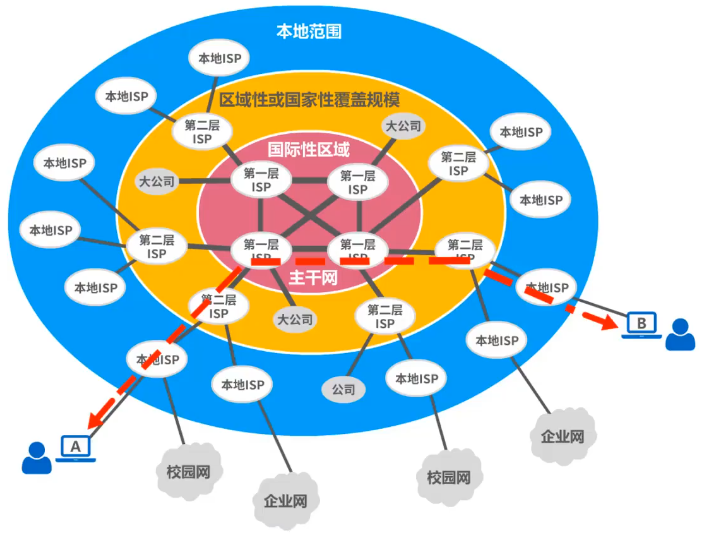

# 网络、互连网(internet)和因特网（互联网Internet）

- 网络有若干==结点==（Node）和连接这些结点的==链路==（Link）组成
- 多个网络还可以通过路由器互连起来，这样就构成了一个覆盖范围更大的网络，即互连网。因此互联网是“==网络的网络==（Network of Networks）”
- 因特网（Internet）是世界上最大的互连网络

## 因特网服务提供者ISP（Internet Service Provider）

## 基于ISP的三层结构的因特网

- 

# 因特网发展的三个阶段

# 因特网的标准化工作

# 因特网的组成

## 边缘部分

- 所有连接在因特网上的==主机==组成。这部分是==用户直接使用==的，用来进行==通信==（传输数据、音频或视频）和==资源共享==

## 核心部分

- ==大量网络==和连接这些网络的==路由器==组成。这部分是==为边缘部分提供服务==的（提供连通性和交换）