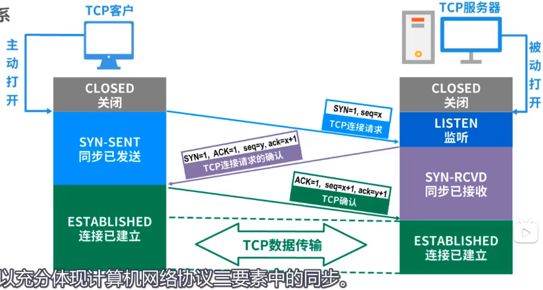
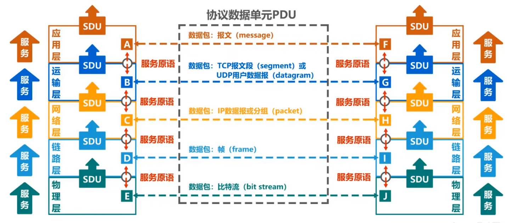

# 常见计算机网络体系结构

- > - IP协议可以为各种网络应用提供服务（Everything over IP）
  > 
  > - 使用IP协议互联不同的网络接口（IP over everthing）

- | OSI体系结构		| TCP/IP         | 原理       |
  | ---------------- | -------------- | ---------- |
  | 应用层           | 应用层         | 应用层     |
  | 表示层           |                |            |
  | 会话层           |                |            |
  | 运输层           | 运输层         | 运输层     |
  | 网络层           | 网际层         | 网络层     |
  | 数据链路层       |              	  | 数据链路层 |
  | 物理层           | 网络接口层        | 物理层     |
  | 法律上的国际标准 | 事实上的国际标准	 | 适于教学   |
  
- 运输层及以下都由操作系统实现和管理

# 分层的必要性

- | 层级 | 作用 |
  | ---- | ---- |
  | 应用层 | 解决通过应用进程的交互来实现特定==网络应用==的问题 |
  | 运输层 | 解决==进程之间==基于网络的==通信==问题 |
  | 网络层 | 解决PDU（数据报）在==多个网络上传输（路由）==的问题（怎样达成一段网络/链路） |
  | 数据链路层 | 解决PDU（帧）在==一个网络（或一段链路）上传输==的问题 |
  | 物理层 | 解决使用何种信号来传输比特的问题 |

- 每一层的核心任务就是：使用下层提供的服务，实现本层功能，为上层提供服务

- 现代网络中，网络层一般采用无连接不可靠传输服务。所以运输层的可靠传输需要运输层自己实现。不过数据链路层还可以采用可靠服务保证一个网络的可靠传输

# 计算机网络体系结构中的专用术语

## 实体

- 任何可发送或接受信息的==硬件==或==软件进程==

## 对等实体

- 收发双方==相同层次中的实体==

## 协议

### Remind

- 控制两个对等实体进行逻辑通信的规则的集合

### 三要素

- 语法：定义所交换信息的格式
- 语义：定义收发双方所要完成的操作
- 同步：定义收发双方的时序关系

## 接口

- 上下层通过接口传输数据，上层通过下层的服务接入口

## 服务

- 在协议的控制下，两个对等实体间的逻辑通信使得本层能够向上一层提供服务
- 要实现本层协议，还需要使用下面一层所提供的服务
- 协议是“==水平的==”，服务是“==垂直的==”
- 实体看得见相邻下层所提供的服务，但并不知道实现该服务的具体协议。也就是说，下面的协议对上面的实体是“==透明==”的
	- eg：我们看得见手机为我们提供的各种服务，但我们只是享受这些服务，而没有弄懂手机的工作原理
- 服务访问点：在同一系统中==相邻两层的实体交换信息的逻辑接口==，用于区分不同的服务类型
	- 数据链路层的服务访问点为帧的“类型”字段
	- 网络层的服务访问点为IP数据包首部中的“协议字段”
	- 运输层的服务访问点为“端口号”
- 服务原语：上层使用下层所提供的服务必须通过与下层==交换一些命令==，这些命令称为服务原语
- 协议数据单元PDU：==对等层次之间传送的数据包==称为该层的协议数据单元
- 服务数据单元SDU：==同一系统内，层与层之间交换的数据包==称为服务数据单元
- 多个SDU可以合成为一个PDU；一个SDU也可以划分为几个PDU
- 
- 
