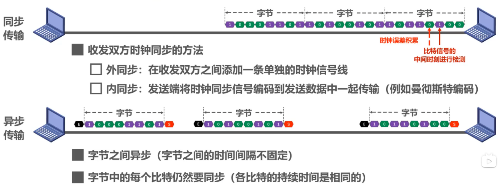

# 传输方式

## ==串行传输==

- > 数据按位顺序传输

- 优点：占用引脚资源少

- 缺点：速度相对较慢

## ==并行传输==

- > 数据各个位同时传输

- 优点：速度快

- 缺点：占用引脚资源多

# 同步机制

## ==异步传输==

- > 不带时钟同步信号传输

## ==同步传输==

- > 带时钟信号传输

## Tip

- 

# 传输方向

## ==（单双工）==

- > 只需要一条信道

## ==双向交替通信（半双工）==

- > 需要两条信道

## ==双向同时通信（全双工）==

- > 需要两条信道
