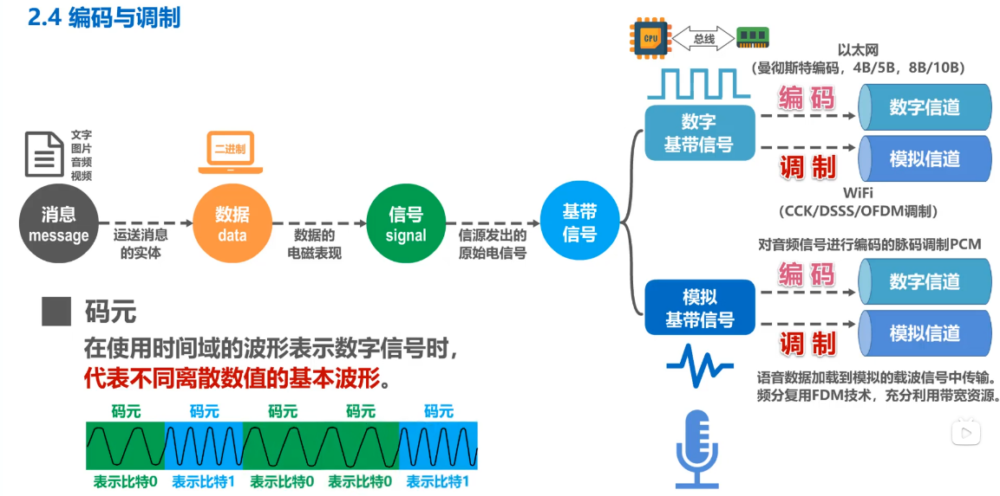
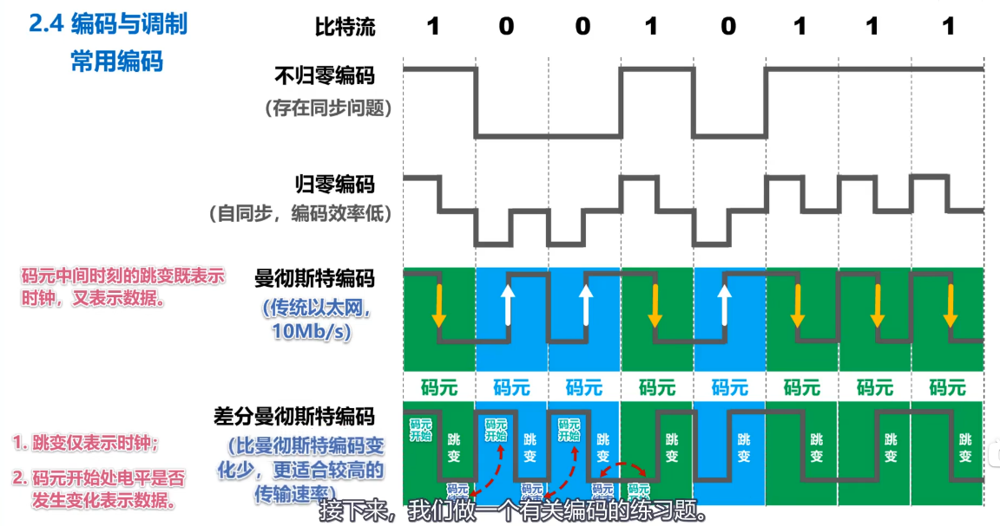
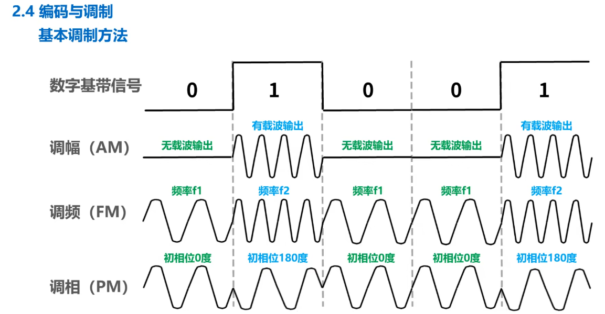
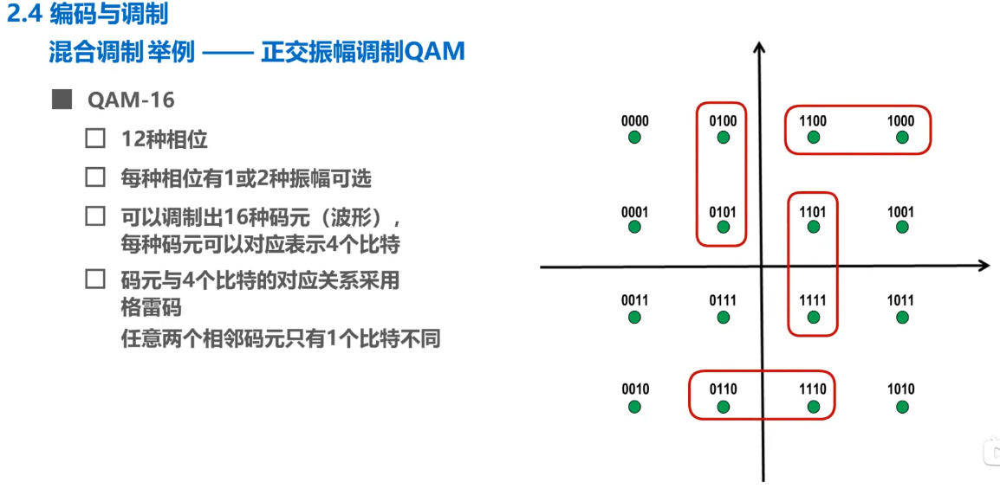

# 基带信号

## 码元

- > 在使用时间域的波形表示数字信号时，==代表不同离散数值的基本波形==。

## 数字基带信号

## 模拟基带信号

## Tip

- 

# 编码

## 常用编码

### 不归零编码

### 归零编码

### 曼彻斯特编码

### 差分曼彻斯特码

### Tip

- 

# 调制

## 频率

## 相位

## 振幅

## 基本调制方法

### 调幅（AM）

### 调频（FM）

### 调相（PM）

### Tip

- 
- 
