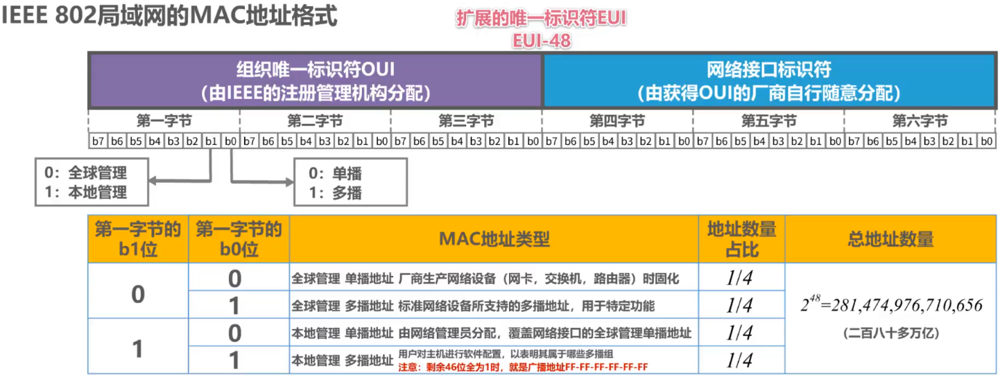
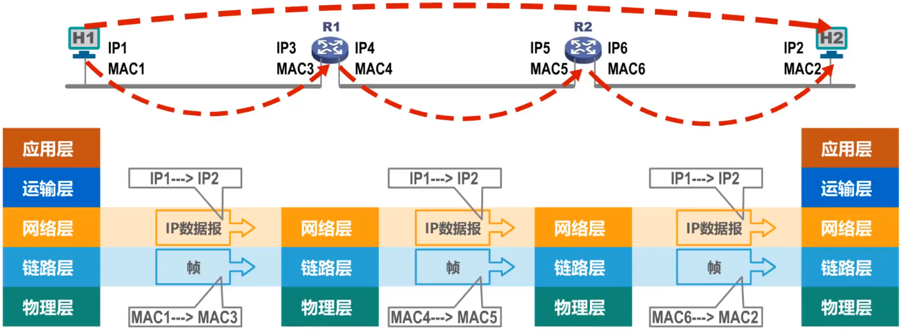

# 联系

- | 层面       | 关系                                                         |
  | ---------- | ------------------------------------------------------------ |
  | 数据链路层 | MAC地址是以太网的MAC子层所使用的地址                         |
  | 网际层     | IP地址是TCP/IP体系结构的网际层所使用的地址                   |
  | ARP协议    | ARP协议属于TCP/IP体系结构的网际层，其作用是已知设备所分配到的IP地址，使用ARP协议可以通过该IP地址获取到设备的MAC地址 |

# MAC地址

## Remind

- > 多个主机连接的同一信道上，实现两个主机之间的通信，则每个主机必须有唯一标识，即一个数据链路层地址

- 每个主机发送的==帧中必须携带标识发送主机和接收主机的地址==。由于这类地址用于媒体接入控制MAC（Media Access Control），因此这类地址被称为==MAC地址==

  - MAC地址一般被固化在网卡（网络适配器）的电可擦可编程只读存储器EEPROM中，因此MAC地址也被称为==硬件地址==
  - MAC地址有时也被称为==物理地址==。==注意：这并不意味着MAC地址属于网络体系结构中的物理层！==

- 一般情况下，用户主机会包含两个网络适配器：有线网卡和无线网卡。每个网卡都有一个全球唯一的MAC地址。而交换机和路由器往往拥有更多的网络接口，所以会拥有更多的MAC地址。综上所述，==严格来说，MAC地址是对网络上各接口的唯一标识，而不是对网络上各设备的唯一标识==

## IEEE 802局域网的MAC地址格式

- 

## IEEE 802局域网的MAC地址发送顺序

### 字节发送顺序

- 第一字节 ---> 第六字节

### 字节内的比特发送顺序

- b~0~ ---> b~7~

## 通信方式

### 单播、广播和多播（组播）

- | 通信方式     | 目的地址字段      |
  | ------------ | ----------------- |
  | 单播         | 目标的MAC地址     |
  | 广播         | FF-FF-FF-FF-FF-FF |
  | 多播（组播） | 多播组地址        |

- 配置多播组列表进行私有应用时，不得使用公有标准多播地址

# IP地址

## Remind

- > - IP地址是因特网（Internet）上的主机和路由器所使用的地址，用于表示两部分信息
  >   - ==网络编号==：标识因特网上数以百万计的网络
  >   - ==主机编号==：标识同一网络上不同主机（或路由器各接口）

- MAC地址不具备区分不同网络的功能

  - 如果只是一个单独的网络，不接入因特网，可以只是用MAC地址（这不是一般用户的应用方式）
  - 如果主机所在的网络要接入因特网，则IP地址和MAC地址都需要使用

## 网络体系结构中IP地址与MAC地址

- 

## 数据包转发过程中IP地址与MAC地址的变化情况

- 
- 数据包转发过程中==源IP地址和目的IP地址保持不变==
- 数据包转发过程中==源MAC地址和目的MAC地址逐个链路（或逐个网络）改变

# ARP协议

## ARP请求报文（广播）

- 封装在MAC帧中，目的地址为FF-FF-FF-FF-FF-FF

## ARP响应报文（单播）

- 封装在MAC帧中，目的地址为发送请求报文的主机的MAC地址

## ARP高速缓存表

#### 记录类型

##### 动态

- 自动获取，生命周期默认两分钟

##### 静态

- 手工设置，不同操作系统下的生命周期不同，例如系统重启后不存在或仍然有效

## ARP流程

1. 源主机在自己的==ARP高速缓存表中查找目的主机的IP地址所对应的MAC地址==。找到，则封装MAC帧发送；找不到，则发送ARP请求
2. 目的主机收到请求报文后，将==源主机的IP地址与MAC地址记录到自己的ARP高速缓存表中==，并发送响应报文
3. 主机A收到响应报文后将主机B的IP地址与MAC地址记录到自己的ARP高速缓存表中

## ==ARP作用范围==

- ==逐段链路或逐个网络使用==（只能在一段链路或一个网络上使用，不能跨网络使用）

## Tip

- ==除ARP请求和响应外，ARP还有其他类型的报文==
- ARP没有安全验证机制，==存在ARP欺骗（攻击）问题==
