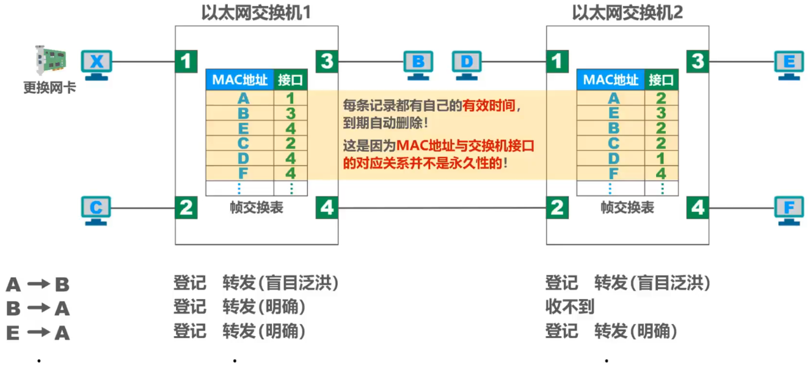

# 集线器与交换机的区别

## 以太网集线器

### 早期的总线型以太网

- 使用同轴电缆

### 使用双绞线和集线器HUB的星型以太网

- ==使用集线器的以太网在逻辑上仍是一个总线网==，各站共享总线资源，==使用的还是CSMA/CD协议==

- ==集线器只工作在物理层==，它的每个接口仅简单地转发比特，不进行碰撞检测（由各站的网卡检测）

- ==集线器一般都有少量的容错能力和网络管理功能==。

  - 例如：
    若网络中某个网卡出了故障，不停地发送帧。此时，集线器可以检测到这个问题，在内部断开与出故障网卡的连线，使整个以太网仍然能正常工作

## 以太网交换机

- 以太网交换机通常都有==多个接口==。每个接口都可以直接与一台主机或另一个以太网交换机相连。一般都工作在==全双工方式==
- 以太网交换机具有并行性，能==同时连通多对接口==，使多对主机能同时通信，==无碰撞==（==不使用CSMA/CD协议==）
- 以太网交换机==工作在数据链路层==（也包括物理层），他收到帧后，在帧交换表中查找==帧的目的MAC地址所对应的接口号==，然后通过该接口转发帧
- 以太网交换机是一种即插即用设备，其内部的==帧交换表==是通过==自学习算法==自动地逐渐建立起来的
- 帧的两种转发方式
  - ==存储转发==
  - ==直通交换==：采用基于硬件的交叉矩阵（交换时时延非常小，但不检查帧是否有差错）

## 对比集线器和交换机

- | 集线器HUB                                                    | 交换机SWITCH                                                 |
  | ------------------------------------------------------------ | ------------------------------------------------------------ |
  | 早期以太网的互联设备                                         | 目前以太网中使用最广泛的互联设备                             |
  | 工作在OSI体系结构的物理层                                    | 工作在OSI体系结构的数据链路层（也包括物理层）                |
  | 对接收到的信号进行放大、转发                                 | 根据MAC地址对帧进行转发                                      |
  | 使用集线器作为互连设备的以太网仍然属于共享总线式以太网。集线器互连起来的所有主机共享总线带宽，属于同一个碰撞域和广播域 | 使用交换机作为互连设备的以太网，称为交换式以太网。交换机可以根据MAC地址过滤帧，即隔离碰撞域 |
  |                                                              | 交换机的每个接口是一个独立的碰撞域                           |
  |                                                              | 交换机隔离碰撞域但不隔离广播域（VLAN除外）                   |

# 以太网交换机自学习和帧转发流程

- 

# 以太网交换机的生成树协议STP

- 如何提高以太网的可靠性？
- 添加==冗余链路==可以提高以太网的可靠性
- 冗余链路会带来负面效应————形成==网络环路==
- 网络环路带来的问题
  - ==广播风暴==
    - 大量消耗网络资源，使得网络无法正常转发其他数据帧
  - ==主机收到重复的广播帧==
    - 大量消耗主机资源
  - ==交换机的帧交换表震荡（漂移）==

- 以太网交换机使用==生成树协议STP==（Spanning Tree Protocol），可以在增加冗余链路来提高网络可靠性的同时又==避免网络环路带来的各种问题==
  - 不论交换机之间采用怎样的物理连接，交换机都能够==自动计算并构建一个逻辑上没有环路的网络==
  - 最终生成的树形逻辑拓扑要==确保连通整个网络==
  - 当首次连接交换机或网络==物理拓扑发生变化==时，交换机都将进行==生成树的重新计算==
