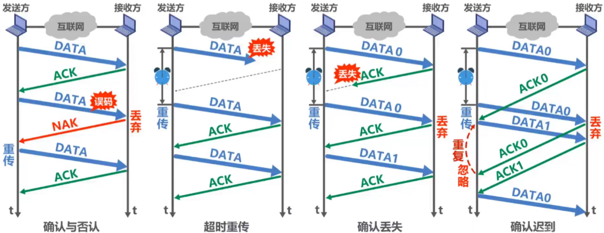
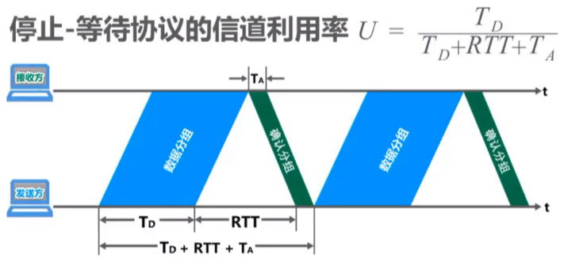

# 基本概念

## Remind

- ==可靠传输服务不仅局限于数据链路层==，其他各层均可选择实现可靠传输
- 可靠传输的实现比较复杂，开销也较大，是否使用可靠传输取决于应用需求

## 数据链路层向上层提供的服务类型

### ==不可靠传输服务==

- > ==仅仅丢弃有误码的帧==，其他什么也不做

### ==可靠传输服务==

- > 想办法实现==发送端发送什么==，==接收端就收到什么==

## 提供服务的情况

### ==有线链路==

- > 一般情况下，误码率较低，为了减小开销，并==不要求数据链路层==向上提供==可靠传输服务==。即使出现了误码，可靠传输的问题由其上层处理

### ==无线链路==

- > 易受干扰，误码率较高，因此==要求数据链路层==必须向上层提供==可靠传输服务

## 传输差错

- > 不仅仅产生在数据链路层

- | 差错类型                | 数据链路层表现形式 |
  | ----------------------- | ------------------ |
  | 比特差错                |                    |
  | 协议数据单元（PDU）丢失 | 帧丢失             |
  | 协议数据单元（PDU）失序 | 帧失序             |
  | 协议数据单元（PDU）重复 | 帧重复             |

- Tip

  - 比特差错一般不会出现在数据链路层，而会出现在其上层

# 实现机制

## Remind

- 节点到节点之间（数据链路）的可靠传输机制

## 停止-等待协议

### Remind

- 
- 

### 停止-等待协议信道利用率

- $$
  U = \frac{T_D}{T_D + RTT + T_A}
  $$

- 

- 

## 回退N帧协议GBN

- 发送方
  - 发送窗口尺寸W~T~的取值范围是==1 < W~T~ <= 2^n^-1==其中，n是构成分组序号的比特数量
    - W~T~ = 1 停止等待协议
    - W~T~ > 2^n^-1 接收方无法分辨新、旧帧
  - 发送方可在未收到接收方确认帧的情况下，将序号落在发送窗口内的多个帧全部发送出去
  - 发送方只有收到对已发送帧的确认时，发送窗口才能向前相应滑动
  - 发送方收到多个重复确认时，可在重传计时器超时前尽早开始重传，由具体实现决定
  - 发送方发送窗口内某个已发送的帧产生超时重发时，其后续在发送窗口内且已发送的帧也必须全部重传，这就是回退N帧协议名称的由来
- 接收方
  - 接收方的接收窗口尺寸W~R~的取值范围是==W~R~ = 1==，因此接收方只能按序接收帧
  - 接收方只接收序号落在接收窗口内且无误码的帧，并且将接收窗口向前滑动一个位置，与此同时给发送方发回相应的确认帧。为了减少开销，接收方==不一定每收到一个按序到达且无误码的帧就给发送方发回一个确认帧==
    - 而是可以在连续收到好几个按序到达且无误码的帧后（由具体实现决定），才针对最后一个帧发送确认帧，这称为==累计确认==
    - 或者可以在自己有帧要发送时才对之前按序接收且无误码的帧进行捎带确认
  - 接收方收到未按序到达的帧，除丢弃外，还要对最近按序接收的帧进行确认
- Tip
  - 回退N帧协议在流水线传输的基础上利用发送窗口来限制发送方连续发送帧的数量，是一种连续ARQ协议
  - 在协议的工作过程中发送窗口和接收窗口不断向前滑动，因此这类协议又称为滑动窗口协议
  - 由于回退N帧协议的特性，当通信线路质量不好时，其信道利用率并不比停止-等待协议高

## 选择重传协议SR

- 发送方
  - 发送窗口尺寸W~T~的取值范围是==1 < W~T~ <= 2^n-1^==其中，n是构成分组序号的比特数量
    - W~T~ = 1 与停止-等待协议相同
    - W~T~ > 2^n-1^ 接收方无法分辨新、旧帧
  - 发送方可在未收到接收方确认帧的情况下，将序号落在发送窗口内的多个帧全部发送出去
  - 发送方只有按序收到对已发送帧的确认时，发送窗口才能向前相应滑动；若收到未按序到达的确认帧时，对其进行记录，以防止其相应帧的超时重发，但发送窗口不能向前滑动
  - 每个帧都有重传计时器，将超时的帧重新发送
- 接收方
  - 接受窗口尺寸W~R~的取值范围是==1 < W~R~ <= W~T~==
    - W~R~ = 1 与停止-等待协议相同
    - W~R~ > W~T~ 无意义
  - 接收方可接受未按序到达但没有误码并且序号落在接收窗口内的帧
    - 为了使发送方仅重传出现差错的分组，接收方不能再采用累计确认，而需要==对每个正确接受到的帧进行逐一确认==
  - 接收方只有在按序接收帧后，接受窗口才能向前相应滑动

## Tip

- | 特性 | 回退N帧协议GBN | 选择重传协议SR |
  | ---- | -------------- | -------------- |
  | 重传方式 | 重传丢失帧及其后续所有帧 |只重传丢失或损坏的帧|
  | 实现复杂度 | 简单 |复杂|
  | 缓冲区需求 | 较少 |较多|
  | 适用场景 | 低延迟、低带宽网络 |高延迟、高带宽网络|