# 基本概念

## Remind

- 共享信道着重考虑的一个问题就是如何协调多个发送和接收站点对一个==共享传输媒体==的占用，即==媒体接入控制MAC==（Medium Access Control）
- 随着交换技术的成熟和成本的降低，具有更高性能的使用点对点链路和链路层交换机的==交换式局域网==在==有线领域==已经完全取代了共享式局域网，但由于无线信道的广播天性，==无线局域网==仍然使用的是==共享媒体技术==

# 媒体接入控制MAC

## 静态划分信道

### Remind

- > 预先固定分配好信道，这类方法非常不灵活，对于突发性数据传输信道利用率会很低

  > 通常在无线网络的物理层中使用，而不是在数据链路层中使用

### 频分多址FDMA

### 时分多址TDMA

### 码分多址CDMA

## 动态接入信道

### 受控接入

#### 集中控制

- 多点轮询协议
  - 有一个主站以循环方式轮询每个站点有无数据发送，只有被轮询到的站点才能发送数据。最大缺点是存在单点故障问题

#### 分散控制

- 令牌传递协议
  - 各站点平等，并连接成一个环形网络
  - 令牌（一个特殊的控制帧）沿环逐站传递，接收到令牌的站点才有权发送数据，并在发完数据后将令牌传递给下一个站点
  - 典型协议
    - IEEE 802.5 令牌环网
    - IEEE 802.4 令牌总线网
    - 光纤分布式数据接口FDDI

### 随机接入

#### Remind

- 所有站点通过竞争，随机地在信道上发送数据。如果恰巧有两个或更多的站点在同一时刻发送数据，则信号在共享媒体上就要产生碰撞（即发生了冲突），使得这些站点的发送都失败。因此，这类协议要解决的关键问题是如何尽量避免冲突及发生冲突后如何尽快恢复通信。著名的共享式以太网采用的就是随机接入

#### 载波监听多址接入/碰撞检测 CSMA/CD（Carrier Sense Multiple Access/Collision Detection）

##### Remind

- 总线局域网使用的协议（有线）

##### 多址接入MA

- 多个站链接在一条总线上

##### 载波监听CS

- 每一个站在发送帧之前先检测一下总线上是否有其他站点在发送帧（“先听后说”）
  - 若检测到总线空闲96比特时间，则发送这个帧
  - 若检测到总线忙，则继续检测并等待总线转为空闲96比特时间，然后发送这个帧

##### 碰撞检测CD

###### 争用期（碰撞窗口）

- 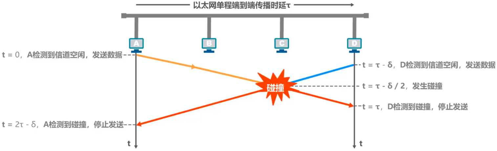
- 以太网的端到端往返传播时延2τ称为==争用期==或==碰撞窗口==（最长碰撞检测时间）
- 以太网中发送帧的主机越多，端到端往返传播时延越大，发生碰撞的概率就越大。因此，==共享式以太网不能连接太多的主机，在使用的总线也不能太长==

###### 最小帧长

- 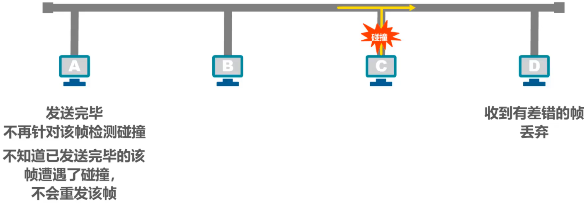
- ==以太网规定最小帧长为64字节==，即512比特（512比特时间即为争用期）
- 以太网的==最小帧长确保了主机可在帧发送完成之前就检测到该帧的发送过程中是否遭遇了碰撞==
  - 如果在争用期没有检测到碰撞，那么后续发送的数据就一定不会发生碰撞
  - 如果在争用内检测到碰撞，就立即中止发送，这时已经发送出去的数据一定小于64字节，因此==凡长度小于64字节的帧都是由于碰撞而异常中止的无效帧==

###### 最大帧长

###### 截断二进制指数退避算法

- 退避时间 = 基本退避时间 × 随机数r
  - 基本退避时间：争用期2τ
  - 随机数r：r从离散的整数集合{0,1,...,(2^k^-1)}中==随机选出==一个数，k=Min[重传次数,10]
- 此算法可==使重传需要推迟的平均时间随重传次数而增大==（这也称为==动态退避==），因而==减小发生碰撞的概率==，有利于整个系统的稳定
- ==当重传达16次仍不能成功时==，表明同时打算发送帧的主机太多，以至于连续发生碰撞，则==丢弃该帧==，并向高层报告

##### 信道利用率

- 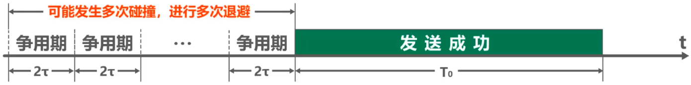

- 理想情况

  - 各主机发送帧都不会产生碰撞

  - 总线一旦空闲就有某个主机立即发送帧

  - 发送一帧占用总线的时间为T~0~+τ，而帧本身的发送时间是T~0~

  - $$
    信道极限利用率 S_{max} = \frac{T_0}{T_0+τ} = \frac{1}{1+\frac{τ}{T_0}} = \frac{1}{1+a}
    $$

    - ==参数a的值尽量小，以提高信道利用率==
    - ==以太网端到端的距离受到限制==
      ==以太网帧的长度应尽量长些==

##### 帧发送流程

- 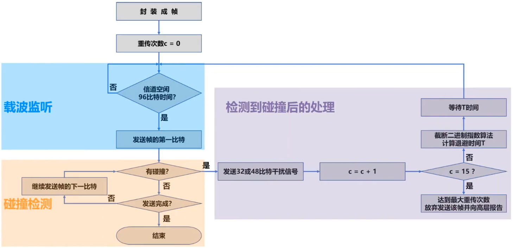

##### 帧接受流程

- 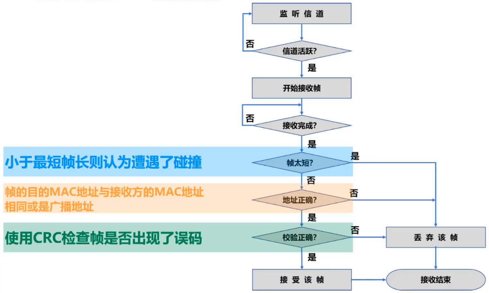

#### 载波监听多址接入/碰撞避免 CSMA/CA（Carrier Sense Multiple Access/Collision Avoidance）

##### Remind

- ==在无线局域网中，仍然可以使用载波监听多址接入CSMA==
- ==在无线局域网中，不能使用碰撞检测==，原因如下
  - 无线信道的传输条件特殊，其信号强度的动态范围非常大，无线网卡上接受到的信号强度往往会远远小于发送信号的强度（可能相差百万倍）。==如果要在无线网卡上实现碰撞检测CD，对硬件的要求非常高==
  - 即使能够在硬件上实现无线局域网的碰撞检测功能，但由于无线电波传播的特殊性（==存在隐蔽站问题==），==进行碰撞检测的意义也不大==
- ==802.11无线局域网==使用CSMA/CA协议，在CSMA的基础上增加了一个==碰撞避免CA功能==，而不再实现碰撞检测功能
- 由于==不可能避免所有的碰撞==，并且==无线信道误码率较高==，802.11标准还使用了==数据链路层确认机制（停止-等待协议）==来保证数据被正确接收
- 802.11的MAC层标准定义了两种不同的媒体接入控制方式
  - ==分布式协调功能DCF==（Distributed Coordination Function）。在DCF方式下，没有中心控制站点，每个站点使用CSMA/CA协议通过争用信道来获取发送权，这是802.11定义的默认方式
  - ==点协调功能PCF==（Point Coordination Function）。PCF方式使用集中控制的进入算法（一般在接入点AP实现集中控制），是802.11定义的可选方式，在实际中较少使用

##### 帧间间隔IFS（InterFrame Space）

- 802.11标准规定，所有==站点必须在持续检测到信道空闲一段指定时间后才能发送帧==，这段时间被称为帧间间隔IFS
- 帧间间隔的长短取决于该站点要发送的帧的类型
  - 高优先级帧需要等待的时间短，因此可优先获得发送权
  - 低优先级帧需要等待的时间长。
- 常用的两种帧间间隔
  - ==短帧间间隔SIFS==（28μs），是最短的帧间间隔，用来分隔开属于一次对话的各帧。一个站点应当能够在这段时间内从发送方式切换到接受方式。使用SIFS的帧类型有ACK帧、CTS帧、由过长的MAC帧分片后的数据帧、以及所有回答AP探询的帧和在PCF方式中接入点AP发送出的任何帧
  - ==DCF帧间间隔DIFS==（128μs），它比短帧间间隔SIFS要长得多，在DCF方式中用来发送数据帧和管理帧

##### CSMA/CA协议的工作原理

- 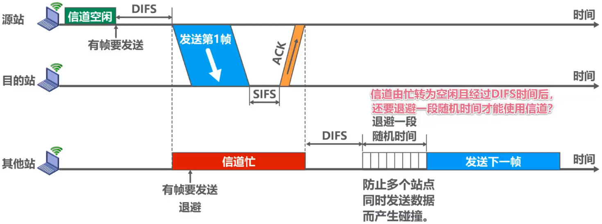
  - 当站点检测到信道是空闲的，并且所发送的数据帧不是成功发送完上一个数据帧之后立即连续发送的数据帧，则不使用退避算法
  - 必须使用退避算法的情况
    - 在发送数据帧之前检测到信道处于忙状态时
    - 在每一次重传一个数据帧时
    - 在每一次成功发送后要连续发送下一个帧时（避免一个站点长时间占用信道）

##### CSMA/CA协议的退避算法

- 在执行退避算法时，站点为退避计时器设置一个随机的退避时间
  - 当退避计时器的时间减小到0时，就开始发送数据
  - 当退避计时器的时间还未减小到0时而信道有转变为忙状态，这时就冻结退避计时器的数值，重新等待信道变为空闲，再经过时间DIFS后，继续启动退避计时器
- 在进行第i次退避时，退避时间在时隙编号{0,1,...,2^2+i^-1}中随机选择一个，然后乘以基本退避时间（也就是一个时隙长度）就可以得到随机的退避时间。使得不同站点选择相同退避时间的概率减少。当时隙编号达到255时（对应于第6次退避）就不再增加了
- 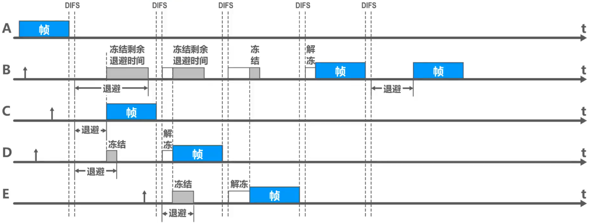

##### CSMA/CA协议的信道预约和虚拟载波监听

###### 信道预约

- 为了==尽可能减少碰撞的概率==和降低碰撞的影响，802.11标准允许要发送数据的站点==对信道进行预约==
  1. 源站在发送数据帧之前先发送一个短的控制帧，称为==请求发送RTS==（Request To Send），它包括源地址、目的地址以及这次通信（包括相应的确认帧）所需的持续时间
  2. 若目的站正确收到源站发来的RTS帧，且媒体空闲，就发送一个响应控制帧，称为==允许发送CTS==（Clear To Send），他也包括这次通信所需的持续时间（复制RTS的）
  3. 源站收到CTS帧后，再等待一段时间SIFS后，就可发送其数据帧
  4. 若目的站正确收到了源站发来的数据帧，在等待时间SIFS后，就向源站发送确认帧ACK
- 除源站和目的站以外的==其它各站==，在==收到CTS帧（或数据帧）后就推迟接入到无线局域网中==。保证了源站和目的站之间的通信不会受到其他站的干扰
- 如果RTS帧发生碰撞，源站就收不到CTS帧，需执行退避算法重传RTS帧
- ==RTS帧和CTS帧很短，发送碰撞的概率、碰撞产生的开销及本身的开销都很小==。而对于一般的数据帧，其发送时延往往大于传播时延（因为是局域网），碰撞的概率很大，且一旦发生碰撞而导致数据帧重发，则浪费时间就很多，因此==用很小的代价对信道进行预约往往是值得的==。802.11标准规定了3种情况供用户选择
  - 使用RTS帧和CTS帧
  - 不使用RTS帧和CTS帧
  - 只有当数据帧的长度超过某一数值时才使用RTS帧和CTS帧
- 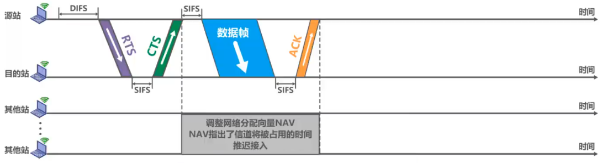

###### 虚拟载波监听

- 不仅RTS帧和CTS帧会携带通信所需时间，数据帧也能携带通信所需时间，这称为802.11的==虚拟载波监听==机制
- 利用虚拟载波监听机制，==站点只要见监听到RTS帧、CTS帧或数据帧中的任何一个，就能知道信道被占用的持续时间==，而不需要真正监听信道上的信号，因此==虚拟载波监听机制能减少隐蔽站带来的碰撞问题==

# 信道复用

## Remind

- 不仅仅局限于媒体接入控制技术，在计算机网络和通信系统的多个层次和领域都有广泛引用
- 复用（Multiplexing）：通过一条物理线路同时传输多路用户的信号
- 当网络中传输媒体的传输容量大于多条单一信道传输的总通信息量时，可利用复用技术在一条物理线路上建立多条通信信道来充分利用传输媒体的带宽

## 频分复用FDM

- 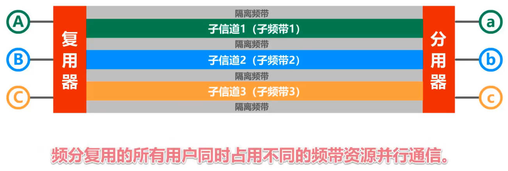

## 时分复用TDM

- 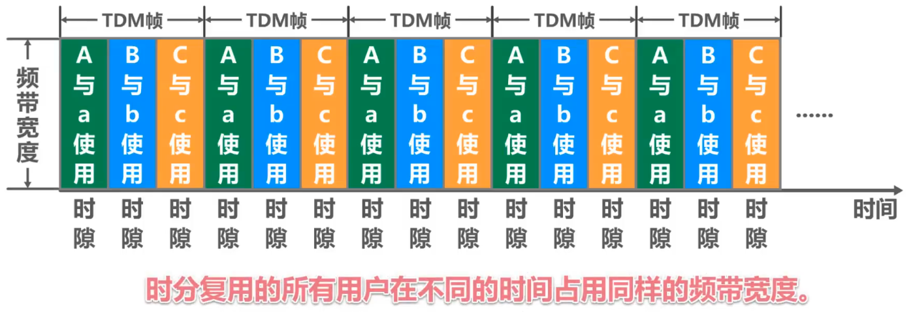
- 时分复用在物理层只支持半双工通信的情况下，做不到真正意义上的全双工通信，而是半双工通信

## 波分复用WDM

- 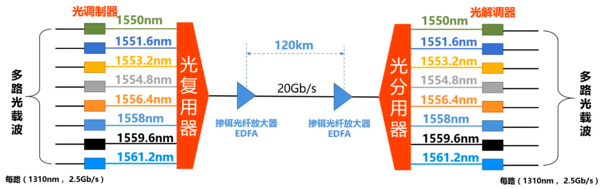

## 码分复用CDM

### Remind

- 码分复用CDM是另一种共享信道的方法。实际上，由于该技术主要用于多址接入，人们更常用的名词是码分多址CMDA（Code Division Multiple Access）
- 同理，频分复用FDM和时分复用TDM同样可以用于多址接入，相应的名词是频分多址FDMA（Frequency Division Multiple Access）和时分多址TDMA（Time Division Multiple Access）
- 在本课程中，我们不严格区分复用与多址的概念。可简单理解如下
  - 复用是将单一媒体的频带资源划分成很多子信道，这些子信道之间相互独立，互不干扰。从媒体的整体频带资源上看，每个子信道只占用该媒体频带资源的一部分
  - 多址（更确切地应该称为多点接入）处理的是动态分配信道给用户。这在用户仅仅暂时性地占用信道的应用中是必须的，而所有的移动通信系统基本上都属于这种情况。相反，在信道永久性地分配给用户的应用中，多址是不需要的（对于无线广播或电视广播站就是这样）
  - 某种程度上，FDMA、TDMA、CDMA可以分别看成是FDM、TDM、CDM的应用
- 由于==各用户使用经过特殊挑选的不同码型==，因此各用户之间==不会造成干扰==
- CDM最初是用于军事通信的，因为这种系统所发送的信号有很强的抗干扰能力，其频谱类似于白噪声，不易被敌人发现

### 码分多址CDMA

- 在CDMA中，每一个比特时间再划分为m个短的间隔，称为==码片==（Chip）。通常m的值是64或128

- 使用CDMA的每一个站被指派一个唯一的==m bit码片序列==（Chip Sequence）

  - 一个站如果要==发送比特1==，则==发送它自己的m bit码片序列==
  - 一个站如果要==发送比特0==，则==发送它自己的m bit码片序列的二进制反码==

- 码片序列的挑选原则

  - 分配给每个站的==码片序列必须各不相同==，实际常采用伪随机码序列

  - 分配给每个站的==码片序列必须相互正交==（规格化内积为0）

    - 令向量S表示站S的码片序列，令向量T表示其他任何站的码片序列

    - 两个不同站S和T，他们的码片序列正交，就是向量S和T的规格化内积为0

      - $$
        S \times T \equiv \frac{1}{m} \sum_{i-1}^m S_i T_i = 0
        $$

      - $$
        S \times \overline T \equiv 0
        $$

      - $$
        S \times S \equiv \frac{1}{m} \sum_{i=1}^m S_i^2 = 1
        $$

      - $$
        S \times \overline S \equiv -1
        $$

- 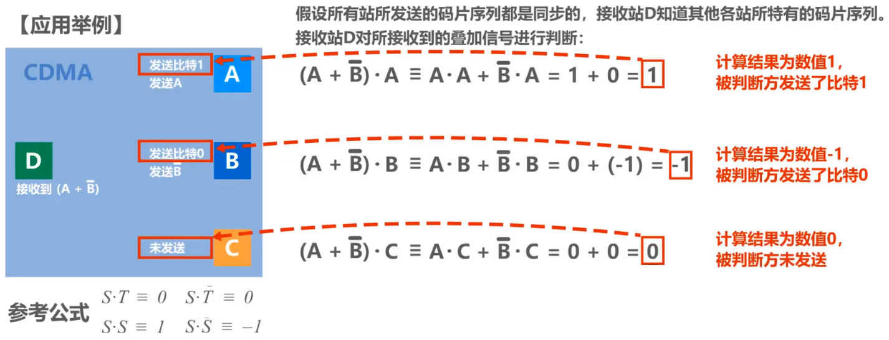

