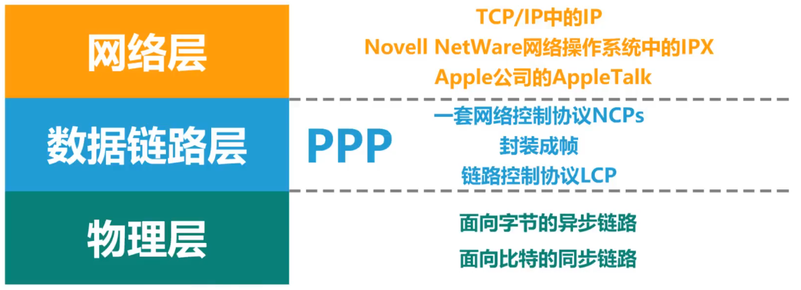
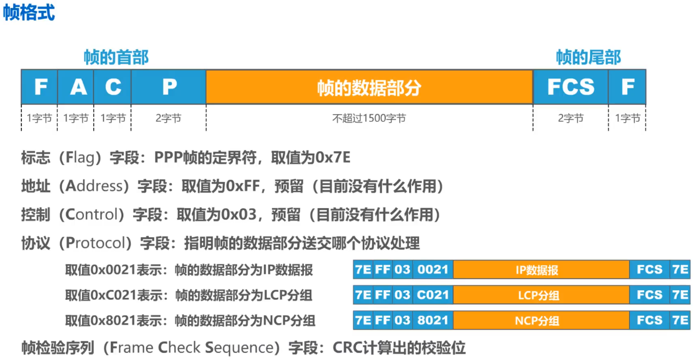
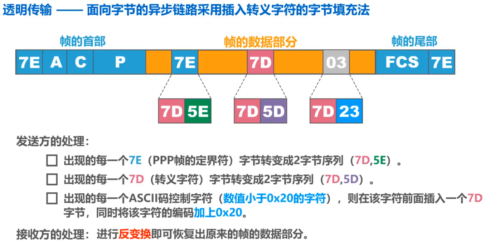
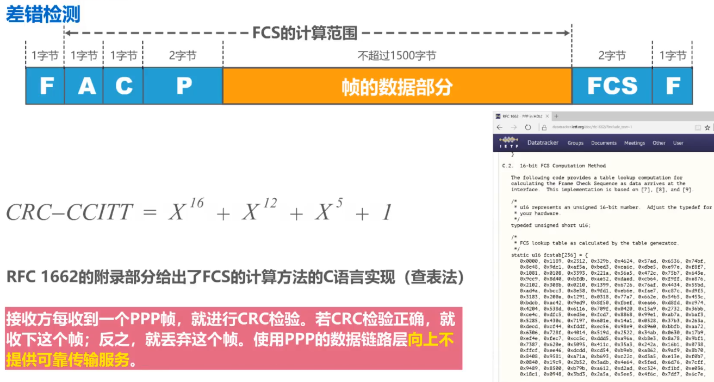
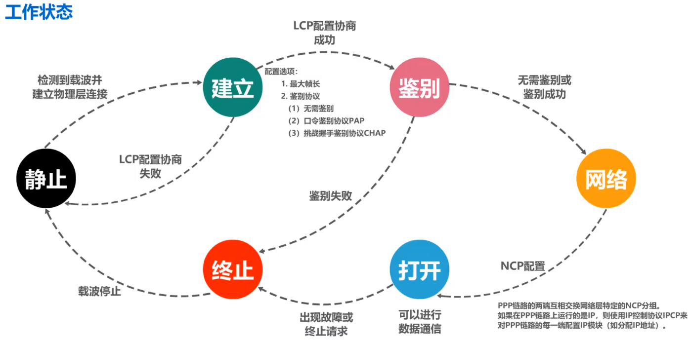

# PPP协议的标准文档[RFC1661,RFC1662]

- 为在点对点链路传输各种协议数据包提供了一个标准方法

# 标准方法

## 主要三部分

### 封装成帧

- > 对各种协议数据报的封装方法

### 链路控制协议LCP：

- > 用于建立、配置以及测试数据链路的链接

### 一套网络控制协议NCPs

- > 其中的每一个协议支持不同的网络层协议

### Tip

- 

# 帧格式

 

# PPP帧的透明传输

## 字节填充法

- > 面向字节的异步链路的方法，插入转义字符

- 

## 比特填充法

- > 面向比特的同步链路的方法，零比特填充

- 发送方处理

  - 对帧的数据部分进行扫描（一般由硬件实现）。只要发现==5个连续的比特1==，则立即==填充1个比特0==

- 接收方处理

  - 对帧的数据部分进行扫描（一般由硬件实现）。只要发现==5个连续的比特1==，就==把其后的1个比特0删除==

# 差错检测

- 

# PPP协议的工作状态

- 
- 静止
- 建立
- 鉴别
- 网络
- 打开
- 终止
