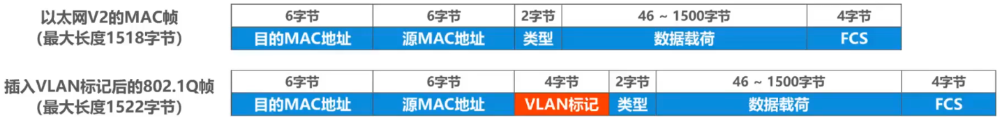
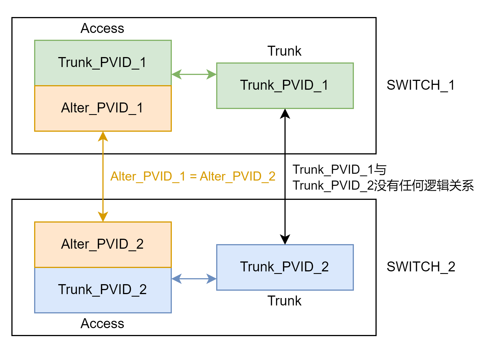

# 概述

## Remind

- > 将局域网内的==设备划分成与物理位置无关的逻辑组的技术，这些逻辑组具有某些共同的需求==

## 应用背景

- 使用一个或多个以太网交换机互连起来的交换式以太网，其所有站点都属于==同一个广播域==

- 巨大的广播域带来的==弊端==

  - 广播风暴
  - 难以管理和维护
  - 潜在的安全问题

- ==网络中会频繁出现广播信息==

  - TCP/IP协议栈中很多协议都会使用广播
    - 地址解析协议ARP（通过IP地址找MAC地址）
    - 路由信息协议RIP（小型内部路由协议）
    - 动态主机配置协议DHCP（用于自动配置IP地址）
  - NetBEUI：Windows下使用的广播型协议
  - IPX/SPX：Novell网络的协议栈
  - Apple Talk：Apple公司的网络协议栈

- 分割广播域方法

  - 使用路由器隔离广播域

  - 虚拟局域网VLAN技术

# 实现机制

## IEEE 802.1Q帧（也称Dot One Q帧）

- > 对以太网的MAC帧格式进行了扩展，插入了==4字节的VLAN标记==

- 

- VLAN标记的==最后12比特==称为==VLAN标识符VID==，他唯一地标志了以太网帧属于哪一个VLAN

  - VID的取值范围是0~4095（0到2^12^-1)
  - 0和4095都不用来表示VLAN，因此用于表示VLAN的==VID的有效取值范围是1~4094==

- ==802.1Q帧是由交换机来处理，而不是用户主机来处理==

  - 当交换机==收到普通的以太网帧==时，将其插入4字节的VLAN标记转变为802.1Q帧，简称“==打标签==”
  - 当交换机==转发802.1Q帧==时，==可能==删除其4字节VLAN标记转变为普通以太网帧，简称“==去标签==”

## 交换机端口类型

### 交换机端口的缺省VLAN ID

- 在思科交换机上称为Native VLAN，即本征VLAN
- 在华为交换机上称为Port VLAN ID，即端口VLAN ID，简记为PVID
  - 交换机的每个端口有且仅有一个PVID

### 三种端口类型

#### Access

##### Remind

- 一般用于连接用户计算机
- 只能属于一个VLAN
- PVID值域端口所属VLAN的ID相同（默认为1）

##### 接收处理方法

- 一般只接受“未打标签”的普通以太网MAC帧
- 根据接受帧的端口的PVID给帧“==打标签==”，字段中的VID取值与端口的PVID取值相等

##### 发送处理方法

- 若有端口的PVID值与帧中的VID相等，则交换机对帧“==去标签==”并从该端口==转发==该帧；否则不转发

#### Trunk

##### Remind

- 一般用于交换机之间或交换机与路由器之间的互连
- 可以属于多个VLAN
- 用户可以设置PVID值（默认为1）

##### 发送处理方法

- 若有端口的PVID值与帧中的VID
  - 相等，则交换机对帧“==去标签==”并从该端口==转发==
  - 不相等，则交换机从该端口==直接转发==

##### 接收处理方法

- 接收“未打标签”的帧，根据接受帧的端口的PVID给帧“==打标签==”，VID取值与端口PIVD取值相等
- 接收“已打标签”的帧

##### Tip

- 设交换机A、B。A网段与B网段通信。

- | 通信方向 | A的Trunk的PVID与Access的PVID是否相等 | B的Trunk的PVID与Access的PVID是否相等 | 发送方与接收方的连接关系 |
    | ----- | ------------------------------------ | ------------------------------------ | ------------------------ |
    | A到B | 相等（Access打标签Trunk去标签） | 相等（Trunk打标签Access去标签） | A_A_ID = A_T_ID，B_A_ID = B_T_ID。使得A网段的A_A_ID的VLAN与B网段的B_A_ID的VLAN融合为一个VLAN |
    |  | 不等（Access标签Trunk直接转发） | 未知（Trunk直接接收Access去标签） | A_A_ID = B_A_ID。使得A、B网段的相同PVID的Access端口的VLAN融为一个VLAN |

- 

    - 通过Trunk端口的特殊机制实现
        - Trunk端口PVID的意义就是在交换机内部与拥有相同PVID的Access端口绑定，使得不同的交换机中不同PVID的Access端口能构成一个VLAN
        - 交换机内部与Trunk端口拥有不同的PVID的==Access端口==会和其他交换机中拥有==相同PVID==的==Access端口==构成一个VLAN

#### Hybrid

##### Remind

- > 思科交换机没有Hybrid端口

- 即可用于交换机之间或交换器与路由器之间的互连（同Trunk），也可用于交换机与路由器之间的互连（同Access）

- 可属于多个VLAN（同Trunk）

- 用户可设置PVID（默认为1，同Trunk）

##### 发送处理方法

- > ==与Trunk端口不同==

- 查看帧的VID是否在端口的“去标签”列表中

  - 存在，则“去标签”再转发
  - 不存在，则直接转发

##### 接受处理方法

- > 同Trunk

