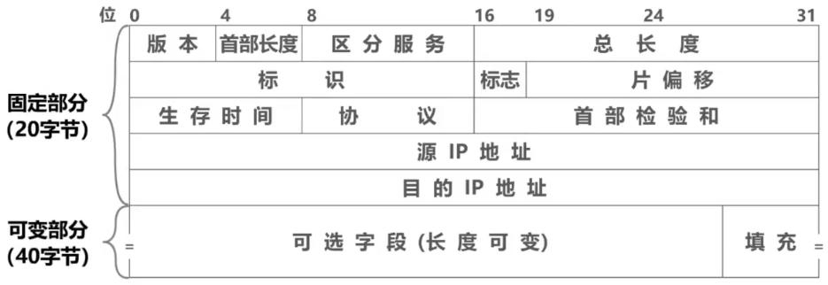

# Remind

- 

# 固定部分

## 版本

- > 4比特，表示IP协议的版本

- 通信双方使用的IP协议的版本必须一致。目前广泛使用的IP协议版本号为4（即IPv4）

## 首部长度

- > 4比特，表示IP数据报首部的长度。该字段的取值以4字节为单位

- 最小十进制取值为5，表示IP数据报首部只有20字节固定部分

- 最大十进制取值为15，表示IP数据报首部包含20字节固定部分和最大40字节可变部分

## 区分服务

- > 8比特，用来获得更好的服务

- 该字段在旧标准中叫作服务类型，但实际上一直没有被使用过。1998年，因特网工程任务组IETF把这个字段改名为区分服务

- 利用该字段的不同数值可提供不同等级的服务质量

- 只有在使用区分服务时，该字段才起作用。一般情况下都不使用该字段

## 总长度

- > 16比特，表示IP数据报的总长度（首部+数据载荷）

- 最大取值为十进制的65535，以字节为单位

## 标识

- > 16比特，属于同一个数据报的各分片数据报应该具有相同的标识

- IP软件维持一个计数器，每产生一个数据报，计数器值加1，并将此值赋给标识字段

## 标志

- > 3比特

- 各比特含义

  - DF位：1表示不允许分片；0表示允许分片

  - MF位：1表示“后面还有分片”；0表示“这是最后一个分片”
  - 保留位：必须为0

## 片偏移

- > 13比特，指出分片数据报的数据载荷部分偏移其在原数据报的位置有多少个单位

- 片偏移以8个字节为单位

## 生存时间TTL

- > 8比特

- 最初以秒为单位，最大生存周期为255秒；路由器转发IP数据报时，将IP数据报首部中的该字段的值减去IP数据报在本路由器上所耗费的时间，若不为0就转发，否则就丢弃

- 现在以“跳数”为单位，路由器转发IP数据报时，将IP数据报首部中的该字段的值减1，若不为0就转发，否则就丢弃

## 协议

- > 8比特，指明IPv4数据报的数据部分是何种协议数据单元

- 常用的一些协议和相应的协议字段值

  - | 协议名称   | ICMP | IGMP | TCP  | UDP  | IPv6 | OSPF |
    | ---------- | ---- | ---- | ---- | ---- | ---- | ---- |
    | 协议字段值 | 1    | 2    | 6    | 17   | 41   | 89   |

## 首部检验和

- > 16比特，用来检测首部在传输过程中是否出现差错。比CRC检验码简单，称为因特网检验和

- IP数据报每经过一个路由器，路由器都要重新计算首部检验和，因为某些字段（生存时间、标志、片偏移等）的取值可能发生变化

- 由于IP层本身并不提供可靠传输的服务，并且计算首部检验和是一项耗时的操作，因此在IPv6中，路由器不在计算首部检验和，从而更快转发IP数据报

## 源IP地址

- > 32比特，发送该IP数据报的源主机IP地址

## 目的IP地址

- > 32比特，接收该IP数据报的目的主机IP地址

## Tip

- 表示、标志和片偏移共同用于IP数据报分片

# 可变部分

## 可选字段

- > 长度从1个字节到40字节不等。用来支持排错、测量及安全等措施

- 可选字段增加了IP数据报的功能，但这同时也使得IP数据报的首部长度成为可变的。折旧增加了每一个路由器处理IP数据报的开销。实际上可选字段很少被使用

## 填充字段

- > 确保首部长度为4字节的整数倍，使用全0进行填充