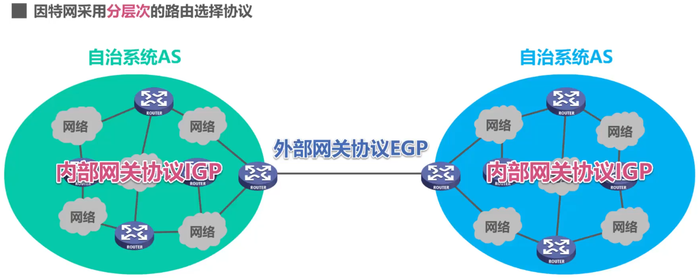
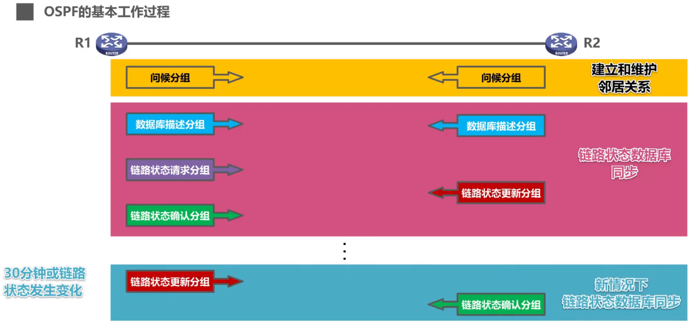
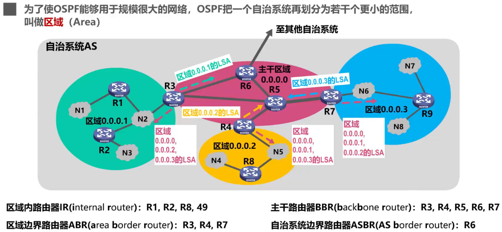
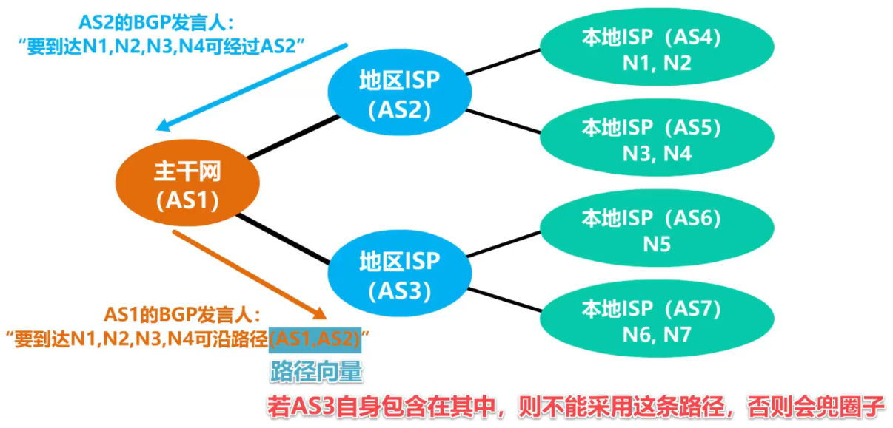
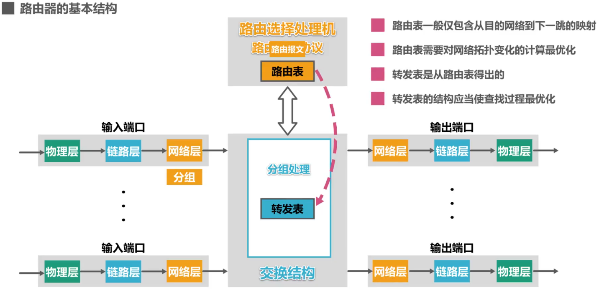

# 静态路由配置及其可能产生的路由环路问题

- 静态路由配置是指用户或网络管理员使用路由器的相关命令给路由器==人工配置路由表==
  - 这种人工配置方式简单、开销小。但==不能及时适应网络状态（流量、拓扑等）的变化==
  - 一般只在小规模网络中采用
- 使用静态路由器配置可能出现以下==导致==产生==路由环路==的错误
  - 配置错误
  - 聚合了不存在的网络
  - 网络故障
- 为了==防止IP数据报在路由器中永久兜圈==，在IP数据报首部设有==生存时间TTL==字段。IP数据报进入路由器后，TTL字段的值减1。若TTL的值不等于0，则被路由器转发，否则被丢弃
- 路由条目的类型
  - 直连网络
  - 静态路由（人工配置）
  - 动态路由（路由器选择协议）
- 特殊的静态路由条目
  - 默认路由（目的网络为0.0.0.0，地址掩码为0.0.0.0）（网络前缀最短，路由最模糊）
  - 特定主机路由（目的网络为特定主机的IP地址，地址掩码为255.255.255.255）（网络前缀最长，路由最具体）
  - 黑洞路由（下一跳为null0）

# 路由选择协议

## Remind

- | 静态路由选择                                                 | 动态路由选择                                         |
  | ------------------------------------------------------------ | ---------------------------------------------------- |
  | 由==人工配置==的网络路由、默认路由、特定主机路由、黑洞路由都属于静态路由 | 路由器通过路由选择协议==自动获取路由信息==           |
  | 这种人工配置方式简单、开销小。但==不能及时适应网络状态（流量、拓扑等）的变化== | 比较复杂、开销比较大。==能较好地适应网络状态的变化== |
  | 一般只在==小规模网络==中采用                                 | 适用于==大规模网络==                                 |

- 因特网所采用的路由选择协议的主要特点

  - 自适应：动态路由选择，能较好地适应网络状态的变化
  - 分布式：路由器之间交换路由信息
  - 分层次：将整个因特网划分为许多较小的自治系统AS（Autonomous System）
    - 

## 内部网关协议IGP

### Remind

- 设法使分组在一个自治系统内尽可能有效地从源网络传输到目的网络
- 无需考虑自治系统外部其他方面的策略

### 路由信息协议RIP

#### Remind

- > 基于==距离向量==，RIP在因特网上最早使用

#### 概述

- RIP要求自治系统AS内的每一个路由器都要维护从它自己到AS内其它每一个网络的距离记录。这是一组距离，称为“==距离向量D-V（Distance Vector）==”

- RIP认为==好的路由==就是“距离短”的路由，也就是==所通过路由器数量最好少的路由==

- 当到达同一目的网络有多条“距离相等”的路由时，可以进行==等价负载均衡==

#### 距离定义

- RIP使用==跳数==（Hop Count）作为度量（Metric）==来衡量到达目的网络的距离==

  - 路由器到直连网路的距离定义为1

  - 路由器到非直连网络的距离定义为所经过的路由器数加1

  - 允许一条路径最多只能包含15个路由器。==“距离”等于16时相当于不可达==。因此，==RIP只适用于小型互联网==

#### 三个要点

- ==和谁交换信息==：仅和==相邻路由器==交换信息
- ==交换什么信息==：自己的==路由表==
- ==何时交换信息==：==周期性交换==（例如每30秒）

#### ==基本工作过程==

1. 路由器开始工作时，==只知道自己到直接网络的距离为1==
2. 每个路由器仅==和相邻路由器周期性地交换并更新路由信息==
3. 若干次交换和更新后，==每个路由器都知道到达本AS内各网络的最短距离和下一跳地址==，称为收敛

#### ==RIP的路由条目的更新规则==

1. 发现了新的网络，添加
2. 到达目的网络
   - 相同下一跳，最新消息，更新
   - 不同下一跳，新路由优势，更新
   - 不同下一跳，新路由劣势，不更新
   - 不同下一跳，等价负载均衡

#### “==坏消息传播得慢==”的问题（==路由环路==或==距离无穷计数==问题）

- ==距离向量算法的一个固有问题==，可采取多种措施==减少==出现该问题的概率或减小该问题带来的危害
  - ==限制最大路径距离==为15（16表示不可达）
  - 当路由表发生变化时就立即发送更新报文（即“==触发更新==”），而不仅是周期性发送
  - 让路由器记录收到某特定路由信息的接口，而不让同一路由信息再通通过此接口向反方向传送（即“==水平分割==”）

### 内部网关路由协议IGRP

- > 基于==距离向量==，IGRP是思科早期私有的协议，现在已被EIGRP取代

### 增强型内部网关路由协议EIGRP

- > 思科私有的，用来取代IGRP的混合型路由协议（结合距离向量和链路状态）

### 开放式最短路径优先OSPF

#### Remind

- > 基于==链路状态==，OSPF在各种网络中广泛使用

#### 概述

- 为克服RIP的缺点而在1989年开发出来
  - “开放”表明OSPF协议不是受某一家厂商控制，而是==公开发表==
  - “最短路径优先”是因为使用了Dijkstra提出的==最短路径算法==SPF

- OSPF是==基于链路状态==，而不像RIP那样是基于距离向量
- OSPF采用SPF算法计算路由，从算法上保证了==不会产生路由环路==
- OSPF==不限制网络规模==，更新小路高，==收敛速度快==
- 链路状态是指本路由器都==和哪些路由器相邻==，以及相应==链路的“代价”==（cost）
  - “代价”用来表示费用、距离、时延、带宽，等等。这些都是由网络管理人员来决定

#### 基本工作机制

1. OSPF相邻路由器之间通过交互==问候（Hello）分组==，建立和维护==邻居关系==

   - Hello分组封装在IP数据报中，发往组播地址224.0.0.5
     - 

   - 发送周期为10秒

   - 40秒未收到来自邻居路由器的Hello分组，则认为该邻居路由器不可达

2. 使用OSPF的每个路由器都会产生==链路状态通告LSA==（Link State Advertisement）。LSA中包含内容

   - 直连网络的链路状态信息

   - 邻居路由器的链路状态信息

3. LSA被封装在==链路状态更新分组LSU==中，采用==洪泛法==发送

4. 使用OSPF的每个路由器都有一个==链路状态数据库LSDB==，用于存储LSA

5. 通过各路由器洪泛发送封装有自己LSA的LSU分组，个路由器的LSDB最终将达到一致

6. 使用OSPF的各路由器==基于LSDB进行最短路径优先SPF计算==，构建出各自到达其他各路由器的最短路径，即构建各自的路由表

#### OSPF五种分组类型

- ==问候==（Hello）分组：用来发现和维护邻居路由器的可达性
- ==数据库描述==（Database Description）分组：向邻居路由器给出自己的链路状态数据库中的所有链路状态项目的摘要信息
- ==链路状态请求==（Link State Request）分组：向邻居路由器请求发送某些链路状态项目的详细信息
- ==链路状态更新==（Link State Update）分组：路由器使用这种分组将其链路状态进行洪泛发送，即用洪泛法对全网更新链路状态
- ==链路状态确认==（Link State Acknowledgment）分组：这是对链路状态更新分组的确认分组

#### 基本工作过程

- 

#### 多点接入网络中路由器邻居关系的建立

- 选举==指定路由器DR==（Designated Router）和==备用指定路由BDR==（Backup Designated Router）
- ==所有的非DR/BDR只与DR/BDR建立邻居关系==
- 非DR/BDR之间通过DR/BDR交换信息

#### 区域

- 为了使OSPF能够用于规模很大的网络，OSPF把一个自治系统再划分为若干个更小的范围，叫做==区域==
- 划分区域的好处就是==把利用洪泛法交换链路状态信息的范围局限于每一个区域而不是整个自治系统==，这就减少了整个网络上的通信量
- 区域标识符：32比特的区域标识，互不相同
- 主干区域：标识符必须为0
- 区域内路由器IR（Internal Router）
- 区域边界路由器ABR（Area Border Router）（可以看做主干路由器）：连接主干区域和自身所在区域，发送区域LSA（向主干发送本区域的区域LSA，向本区域发送本系统内除本区域外的所有区域的区域LSA）
- 主干路由器BBR（Backbone Router）
- 自治系统边界路由器ASBR（AS Border Router）：连接其他系统和自身所在系统
- 

### 中间系统到中间系统IS-IS

- > 基于==链路状态==，集成化IS-IS是ISP骨干网上最常用的IGP协议

## 外部网关协议EGP

### Remind

- 在不同自治系统内，度量路由的“代价”（距离、带宽、费用等）可能不同。因此对于自治系统之间的路由选择，使用“代价”作为度量来寻找最佳路由是不行的
- 自治系统之间的路由选择必须考虑相关策略（政治、经济、安全等）

### 边界网关协议BGP

#### Remind

- BGP只能是力求寻找一条能够到达目的网络比较好的路由（不能兜圈子），而并非要寻找一条最佳路由
- BGP适用于多级结构的因特网
  - 

#### 基本工作机制

- 在配置BGP时，每个自治系统的管理员要选择至少一个路由器作为该自治系统的“==BGP发言人==”
- 不同自治系统的BGP发言人要交换路由信息，首先必须建立==TCP连接==，端口号为179
  - 在此TCP连接上交换BGP报文以建立==BGP会话==
  - 利用BGP会话==交换路由信息==（例如，增加新的路由，或撤销过时的路由，以及报告出错的情况等）
  - 使用TCP连接交换路由信息的两个BGP发言人，彼此称为对方的==邻站==（neighbor）或==对等站==（peer）
- BGP发言人==交换网络可达性的信息==（要到达某个网络所要经过的一系列自治系统）
- 当BGP发言人互相交换了网络可达性的信息后，各BGP发言人就==根据==所采用的==策略==从收到的路由信息中==找出到达各自治系统的较好的路由==。也就是构造出树形结构、==不存在回路的自治系统连通图==

#### BGP-4四种报文

- ==OPEN（打开）报文==：与相邻的另一个BGP发言人建立联系，使通信初始化
- ==UPDATE（更新）报文==：通告某一路由的信息，以及列出要撤销的多条路由
- ==KEEPALIVE（保活）报文==：周期性地证实邻站的连通性
- ==NOTIFICATION（通知）报文==：发送检测到的差错

# 路由器的基本结构

- 

# Tip

- 虽然路由器只工作在物理层、数据链路层和网络层，但是==路由器可以读取部分运输层信息==。例如网络地址转换NAT中的PAT方式，路由器会根据不同的运输层端口号分发到不同路由器设备
