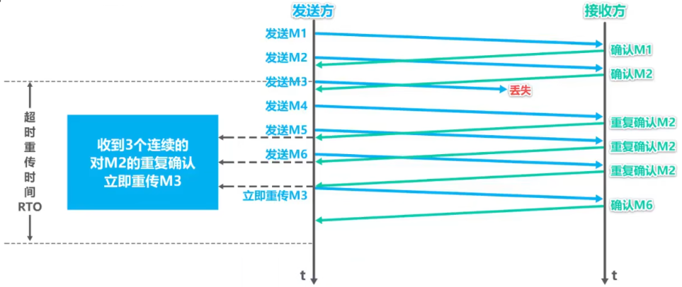
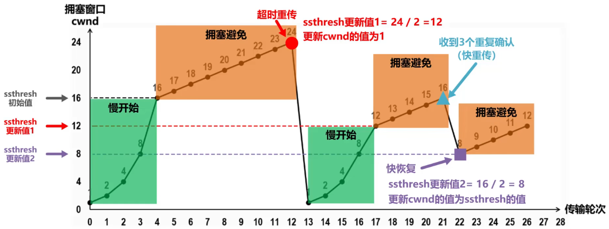
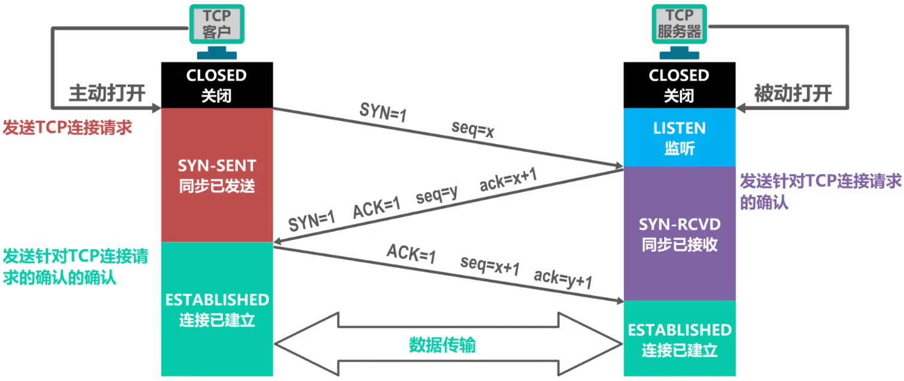
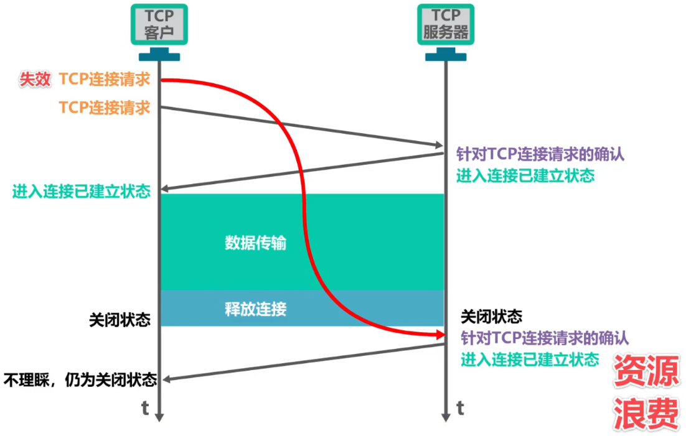
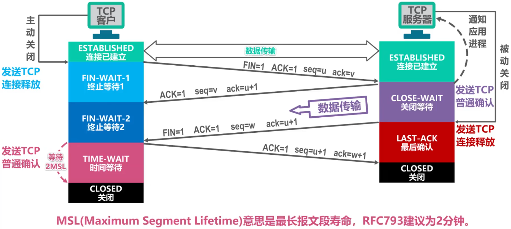
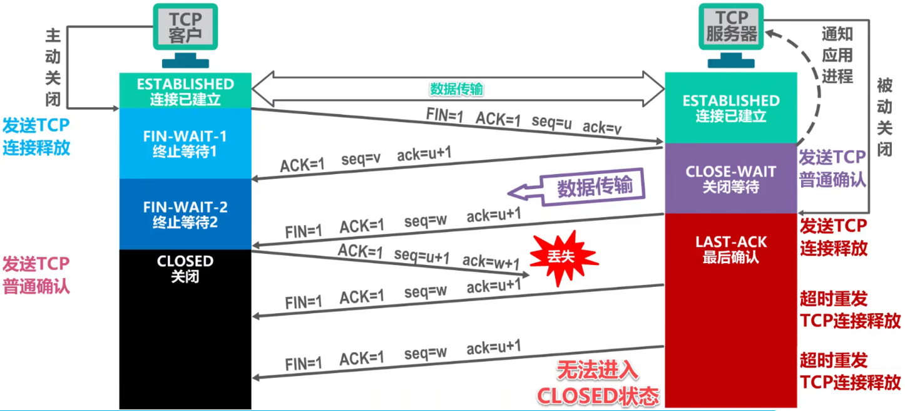
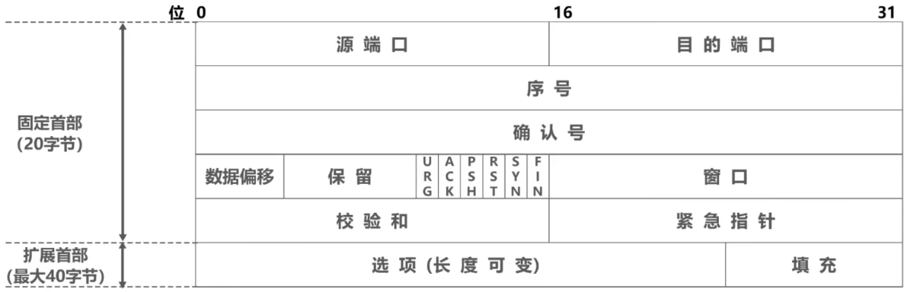

# 对比

- | 用户数据报协议UDP（User Datagram Protocol）                  | 传输控制协议TCP（Transmission Control Protocol）          |
  | ------------------------------------------------------------ | --------------------------------------------------------- |
  | 无连接                                                       | 面向连接                                                  |
  | 支持==进程==的一对一、一对多、多对一和多对多（单播、广播、多播）通信 | 每一条TCP连接只能有两个端点EP，只支持==进程==的一对一通信 |
  | 对应用层交付的报文直接打包                                   | 面向字节流                                                |
  | 尽最大努力交付，也就是不可靠；不使用流量控制和拥塞控制       | 可靠传输；使用流量控制和拥塞控制                          |
  | 首部开销小，仅8字节                                          | 首部最小20字节，最大60字节                                |

# TCP

## 流量控制（flow control）

- > ==使发送方的发送速率不要太快，要让接收方来得及接收==

- 利用==滑动窗口==机制可以很方便地在TCP连接上实现对发送方的流量控制

  - TCP接收方利用自己的==接收窗口==的大小来限制发送方==发送窗口==的大小
  - TCP发送方收到接收方的==零窗口通知==后，应启动==持续计时器==（防止调整窗口的信息丢失导致一直0窗口）。持续计时器超时后，向接收方发送==零窗口探测报文==（丢失也没关系，它也有计时器），携带1字节数据，使接收窗口确认并通告自己的接收窗口。

## 拥塞控制

### Remind

- > 在某段时间，若==对网络中某一资源的需求超过了该资源所能提供的可用部分，网络性能就要变坏==。这种情况就叫做==拥塞==（congestion）。（在计算机网络中的链路容量（即带宽）、交换结点结点中的缓存和处理机等，都是网络的资源

- 若==出现拥塞而不进行控制==，整个网络的==吞吐量将随输入负荷的增大而下降==

### 四种拥塞控制算法

#### 假定条件

- 数据是单方向传送，而另一个方向只传送确认
- 接收方总是有足够大的缓存空间，因而发送方发送窗口的大小由网络的拥塞程度来决定
- 以最大报文段MSS的个数为讨论问题的单位，而不是以字节为单位

#### 基本机制

- 发送方为一个叫做==拥塞窗口cwnd==的状态变量，其值==取决于网络的拥塞程度==，并且==动态变化==
  - 拥塞窗口==cwnd的维护原则==：只要网络==没有出现拥塞，拥塞窗口就增大==一些；但只要网络==出现拥塞，拥塞窗口就减少==一些
  - 判断出现==网络拥塞的依据==：没有按时收到应当到达的确认报文（即==发生超时重传==）
- 发送方将拥塞窗口作为==发送窗口swnd==，即==swnd=cwnd==
- 维护一个慢开始门限==ssthresh==状态变量
  - 当cwnd < ssthresh时，使用慢开始算法
  - 当cwnd < ssthresh时，停止使用慢开始算法而改用拥塞避免算法
  - 当cwnd = ssthresh时，既可使用慢开始算法，也可使用拥塞避免算法

#### 慢开始（slow-start）

- > “慢开始”是指一开始向网络注入的报文段少，并不是指cwnd增长速度慢

- 初始值小：发送方从一个较小的cwnd开始，通常为1个MSS

- 指数增长：每收到一个ACK，cwnd加倍

#### 拥塞避免（congestion avoidance）

- > 不能完全避免拥塞，只是使网络比较不容易出现拥塞

- 线性增长

#### 快重传（fast retransmit）

- 使发送方==尽快进行重传==，而==不是等超时重传计时器超时==再重传
  - 要求接收方不要等待自己发送数据时才进行捎带确认，而是要==立即发送确认==
  - 即使收到了失序的报文段也要立即发出对已收到的报文段的==重复确认==
  - 发送方一旦==收到3个连续的重复确认==，就将相应的报文段==立即重传==，而不是等该报文段的超时重传计时器超时再重传
  - 对于个别丢失的报文段，发送方不会出现超时重传，也就不会误认为出现了拥塞（进而降低拥塞窗口cwnd为1）。使用快重传可以使整个网络的吞吐量提高约20%
- 

#### 快恢复（fast recovery）

- 发送方一旦==收到3个重复确认==，就知道现在只是丢失了个别的报文段。于是不启动慢开始算法，而==执行快恢复算法==
  - ==发送方将慢开始门限ssthresh值和拥塞窗口cwnd值调整为当前窗口的一半；开始执行拥塞避免算法==
  - 也有的快恢复实现是把快恢复开始时的拥塞窗口cwnd值再增大一些，即等于新的ssthresh + 3
    - 既然发送方收到3个重复的确认，就表明有3个数据报文段已经离开了网络
    - 这3个报文段不在消耗网络资源而是停留在接收方的接收缓存中
    - 可见现在网络中不是堆积了报文段而是减少了3个报文段。因此可以适当把拥塞窗口扩大些

#### Tip

- 

## 超时重传时间的选择

### Remind

- ==不能直接使用某次测量得到的RTT样本来计算超时重传时间RTO==
- 利用每次测量得到的RTT样本，计算加权平均==往返时间RTT~s~==（又称平滑的往返时间）
  - ==RTT~S1~=RTT~1~==
    ==新的RTT~S~ = (1-α) × 旧的RTT~S~ + α × 新的RTT样本==
    在上式中，0 <= α < 1，已成为建议标准的RFC6298推荐的α值为1/8，即0.125
- ==超时重传时间RTO应略大于加权平均往返时间RTT~S~==

### RFC6298标准

#### 超时重传时间RTO

- RTO = RTT~S~ + 4 × RTT~D~
  - 加权平均往返时间RTT~S~
    - RTT~S1~ = RTT~1~
      新的RTT~S~ = (1-α) × 旧的RTT~S~ + α × 新的RTT样本 (0 <= α < 1)
      已成为建议标准的RFC6298推荐的α值为1/8，即0.125
  - RTT偏差的加权平均RTT~D~
    - RTT~D1~ = RTT~1~ ÷ 2
      新的RTT~D~ = (1-β) × 旧的RTT~D~ + β × |RTT~S~ - 新的RTT样本| (0 <= β < 1)
      已成为建议标准的RFC6298推荐的β值为1/4，即0.25
- 出现超时重传时，新RTO = 2 × 旧RTO（因为分辨确认报文段是对原报文段还是重传报文段的确认较为麻烦）

## 可靠传输的实现

- TCP基于==以字节为单位的滑动窗口==来实现可靠传输
  - 发送方在未收到接收方的确认时，可将发送窗口内还未发送的数据全部发送出去
  - 接收方只接收序号落入发送窗口内的数据
- 同一时刻，==发送方的发送窗口并不总是和接收方的接收窗口==一样大
  - 网络传送窗口值需要经历一定的时间滞后，并且这个时间还是不确定的
  - 发送方还可能根据网络当时的拥塞情况适当减小自己的发送窗口尺寸
- 对于==不按序到达的数据应如何处理==，TCP并无明确规定
  - 如果接收方把不按序到达的数据一律丢弃，那么接受窗口的管理将会比较简单，但这样做对网络资源的利用不利，因为发送方会重复传送较多的数据
  - TCP通常对不按序到达的数据是先临时存放在接收窗口中，等到字节流中所缺少的字节收到后，再==按序交付上层的应用进程==
- TCP要求接收方必须有==累积确认和捎带确认机制==，这样可以减小传输开销。接收方可以在合适的时候发送确认，也可以在自己有数据要发送时把确认信息捎带上
  - ==接收方不应过分推迟发送确认==，否则会导致发送方不必要的超时重传，这反而浪费了网络的资源
    TCP标准规定，确认推迟的时间不应超过0.5秒。若收到一连串具有最大长度的报文段，则必须每隔一个报文段就发送一个确认[RFC 1122]
  - 捎带确认实际上并不经常发生，因为大多数应用程序很少同时在两个方向上发送数据
- ==TCP的通信是全双工通信==。通信中的每一方都在发送和接收报文段。因此，每一方都有自己的发送窗口和接收窗口。在谈到这些窗口时，一定要弄清楚是哪一方的窗口

## TCP的运输连接管理

### 概述

- TCP是面向连接的协议，它基于运输连接来传送TCP报文段
- TCP运输连接的建立和释放是每一次面向连接的通信中必不可少的过程
- TCP运输连接的三个阶段
  - ==建立TCP连接==
  - ==数据传送==
  - ==释放TCP连接==
- TCP的运输管理就是使运输连接的建立和释放都能正常地进行

### TCP的连接建立

#### Remind

- TCP的连接建立要解决的三个问题
  - 使TCP双方能够确知对方的存在
  - 使TCP双方能够协商一些参数（如最大窗口值、是否使用窗口扩大选项和时间戳选项以及服务质量等）
  - 使TCP双方能够对运输实体资源（如缓存大小、连接表中的项目等）进行分配
- TCP使用“三报文握手”建立连接

#### ==三报文握手==

##### 基本工作流程

- 
  - ==注意==
    - ==TCP的标准规定，SYN=1的报文段不能携带数据，但要消耗掉一个序号==
    - ==TCP的标准规定，普通的确认报文段（非SYN同步请求报文段）如果不携带数据，则不消耗序号==

##### 关键标志位

###### 同步标志位SYN

- 用于发起连接请求，取值0或1
- 在第一次和第二次握手中，SYN=1表示请求同步序列号

###### 确认标志位ACK

- 用于确认接收到的数据，取值0或1
- 在第二次和第三次握手中，ACK=1表示确认对方的序列号（本质是ACK=1使本次确认号字段ack有效）

##### 序号和确认号

###### 序列号seq（Sequence Number）

- 作用：标识发送方数据的字节流顺序
- 在三次我握手中的作用
  - 客户端在第一次握手中发送一个初始序列号（ISN）
  - 服务器在第二次握手中发送自己的初始序列号
  - 序列号用于确保数据的有序传输和可靠性

###### 确认号ack（Acknowledgement Number）

- 作用：用于确认收到的数据，表示期望接收的下一个字节的序列号
- 在三次握手中的作用
  - 服务器在第二次握手中将客户端的序列号加1作为确认号（ack=seq+1）
  - 客户端在第三次握手中将服务器的序列号加1作为确认号（ack=seq+1）

#### 为什么不采用二报文握手

- 

### TCP的连接释放

#### Remind

- TCP通过“四报文挥手”来释放连接

#### 四报文挥手

##### 基本工作流程

- 
- 为什么需要有TIME-WAIT时间等待
  - 
- 为什么是四次？
  - 因为特殊请求报文必须要有确认报文
    - 因为如果对特殊请求报文不用确认，而是发送方发完请求报文就关闭连接。那么出现特殊请求报文丢失的情况后，接收方依然保持运行状态，但其实连接已经关闭，且发送方也不会再发送特殊请求报文使接收方关闭连接
  - 因为第一次请求关闭时服务端一般还有部分数据没有发送完，等处理完服务端就会确认关闭。在正式确认关闭前先确认收到了客户端的关闭请求，使客户端不会认为请求丢失而不断重发请求

##### 关键标志位

###### 完成标志位FIN

- 用于请求关闭连接，取值0或1
- 在第一次和第三次挥手中，FIN=1表示请求关闭连接

#### 保活计时器

- TCP服务器进程每收到一次TCP客户进程的数据，就重新设置并启动==保活计时器==（2小时定时）
- 若保活计时器定时周期内未收到TCP客户进程发来的数据，则==当保活计时器到时后，TCP服务器进程就向TCP客户进程发送一个探测报文段==，以后则每隔75秒钟发送一次。若一连发送出10个探测报文段后仍无TCP客户进程的响应，TCP服务器进程就认为TCP客户进程所在主机出了故障，接着就关闭这个连接

## TCP报文段的首部格式

### Remind

- 为了实现可靠传输，TCP采用了==面向字节流==的方式
- 但TCP在发送数据时，是从发送缓存取出一部分或全部字节并给其添加一个首部使之成为==TCP报文段==后进行发送
  - 一个TCP报文段由==首部==和==数据载荷==两部分构成
  - TCP的全部功能都体现在它首部中各字段的作用

### 首部格式

- 

### 源端口

- > 16比特，写入源端口号，用来==标识发送该TCP报文段的应用进程==

### 目的端口

- > 16比特，写入目的端口号，用来==标识接收该TCP报文段的应用进程==

### 序号

- > 32比特，取值范围[0,2^32^-1]，序号增加到最后一个后，下一个序号就又回到0。
- ==指出本TCP报文段数据载荷的第一个字节的序号==
- 在整个字节流中他的标号

### 确认号

- > 32比特，取值范围[0,2^32^-1]，确认号增加到最后一个后，下一个确认号就又回到0
- ==指出期望收到对方下一个TCP报文段的数据载荷的第一个字节的序号，同时也是对之前收到的所有数据的确认==
- ==若确认号=n，则表明到序号n-1为止的所有数据都已正确接收，期望接收序号为n的数据==

### 确认标志位ACK

- > 取值为1时确认号字段才有效；取值为0时确认号字段无效
- ==TCP规定，在连接建立后所有传送的TCP报文段都必须把ACK置1==

  

### 数据偏移

- > 4比特，并以4字节为单位
- ==用来指出TCP报文段的数据载荷部分的起始处理距离TCP报文段的起始处有多远==
- ==这个字段实际上是指出了TCP报文段的首部长度==
  - 首部固定长度为20字节，因此数据偏移字段的最小值为(0101)~2~
  - 首部最大长度为60字节，因此数据偏移字段的最大值为(1111)~2~

### 保留

- > 6比特，保留为今后使用，但目前应置为0

### 窗口

- > 16比特，以字节为单位。==指出发送本报文段的一方的接收窗口==
- ==窗口值作为接收方让发送方设置其发送窗口的依据==
- 这是以接收方的接受能力来控制的发送方的发送能力，称为流量控制

### 校验和

- > 16比特，检查范围包括TCP报文段的首部和数据载荷两部分
- 在计算校验和时，要在TCP报文段的前面加上12字节的伪首部

### 同步标志位SYN

- > 在TCP连接建立时用来同步序号，取值0或1

### 终止标志位FIN

- > 用来释放TCP连接，取值0或1

### 复位标志位RST

- > 用来复位TCP连接，取值0或1

- ==当RST=1时，表明TCP连接出现了异常，必须释放连接，然后再重新建立连接==

- ==RST置1还用来拒绝一个非法的报文段或拒绝打开一个TCP连接==

### 推送标志位PSH

- > 接收方的TCP收到该标志位为1的报文段会==尽快上交应用进程==，而不必等到接收缓存都填满后再向上交付

### 紧急标志位URG

- > 取值为1时紧急指针字段有效；取值为0时紧急指针字段无效

### 紧急指针

- > 16比特，以字节为单位，用来指明紧急数据的长度

- ==当发送方有紧急数据时，可将紧急数据插队到发送缓存的最前面，并立刻封装到一个TCP报文段中进行发送。紧急指针会指出本报文段数据载荷部分包含了多长的紧急数据，紧急数据之后是普通数据==

### 选项

#### 最大报文段长度MSS选项

- > TCP报文段数据载荷部分的最大长度

#### 窗口扩大选项

- > 为了扩大窗口（提高吞吐率）

#### 时间戳选项

- 用来计算往返时间RTT
- 用于处理序号超范围的情况，又称为防止序号绕回PAWS

#### 选择确认选项

- 用来实现选择确认功能

### 填充

- 用于选项的长度可变，因此使用填充来==确保报文段首部能被4整除==（因为数据偏移字段，是以4字节为单位的）
