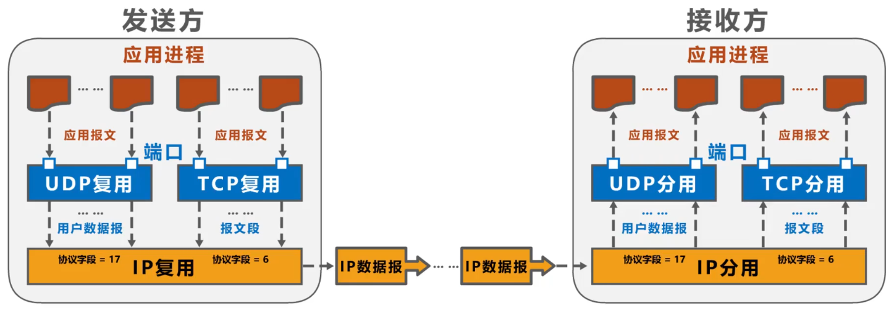

# 端口号

## Remind

- 运行在计算机上的进程使用==进程标识符PID==来标识，因特网上的计算机并不是使用统一的操作系统，不同的操作系统又使用==不同格式的进程标识符==。为了使不同操作系统的进程之间可以通信，就必须==使用统一的方法对TCP/IP体系的应用进程进行标识==

## TCP/IP体系的运输层

### Remind

- TCP/IP体系的运输层使用==端口号==来区分应用层的不同应用进程

### 端口号

#### 表示方式

- ==16比特==，取值范围==0~65535==

#### 类型

##### ==熟知端口号==

- > 0~1023，IANA把这些端口号指派给了TCP/IP体系中最重要的一些应用协议，例如：FTP使用21/20，HTTP使用80，DNS使用53

- 服务端将会使用默认端口作为协议接收端口，保证客户端首次能够找到服务器处理请求的进程。客户端的端口随意

##### ==登记端口号==

- > 1024~49151，为没有熟知端口号的应用程序使用。使用这类端口号必须在IANA按照规定的手续登记，以防止重复

##### ==短暂端口号==

- > 49152~65535，留给客户进程选择暂时使用。当服务器进程收到客户进程的报文时，就知道了客户进程所使用的动态端口号。通信结束后，这个端口号可供其他客户进程以后使用

## Tip

- ==端口号只具有本地意义==，即端口号只是为了==标识本计算机应用层中的各进程==，在因特网中，==不同计算机中的相同端口号是没有联系的==

# 复用与分用

## 发送方的复用和接收方的分用

- 

- | 复用                                | 分用                                                    |
  | ----------------------------------- | ------------------------------------------------------- |
  | 不同应用层PDU使用某一运输层协议封装 | 运输层根据运输层PDU中的端口号分发给不同的应用层进程     |
  | 不同运输层PDU使用网络层IP协议封装   | 网络层根据IP协议的PDU中的协议字段分发给不同的运输层协议 |

  
