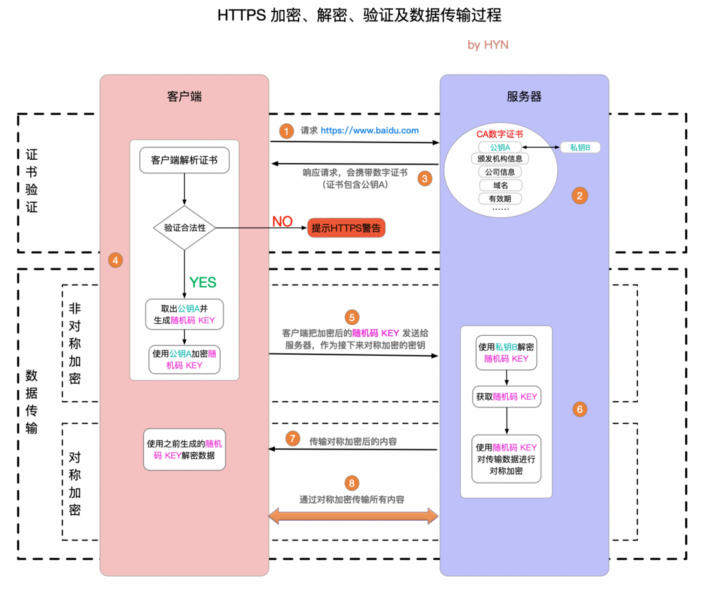

# 加密

## 数据加密

### 加密过程

- 数据 + 秘钥 = 密文

### 解密过程

- 密文 - 秘钥 = 数据

## 对称加密

- 概念：加密算法公开，依靠秘钥加密数据，使用一个秘钥加密，必须使用相同的秘钥才解密
- 优点：算法公开、计算量小、加密速度快、加密效率高
- 缺点：数据传送前，双方必须商定好秘钥，且保存好秘钥（就是防止秘钥泄露）

## 非对称加密

- 概念：加密和解密使用不同的秘钥。只有私钥才能解密用公钥加密的数据

# SSL/TLS证书

- 保存在源服务器的数据文件，包含公钥
- CA证书的本质是CA私钥加密的数据，客户可以用CA公开的公钥解密，从而确认数据确实是CA签发的。也就证明了数据的真实性

# 基本原理

- 
- 利用非对称加密传递对称加密的秘钥
- 使用三个随机数生成最后的对称密钥，就像哈希加盐，可以避免相同的数据生成相同的密文

# 使用端口

- http的80端口，https的443端口