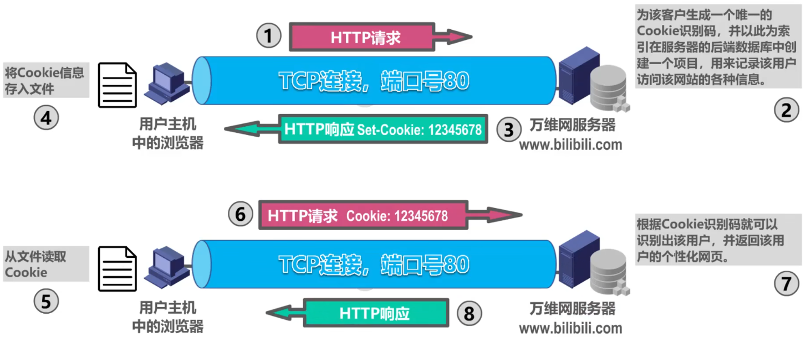

# 概述

- 万维网WWW（World Wide Web）==并非某种特殊的计算机网络==。它是一个大规模的、联机式的信息储藏所，==是运行在因特网上的一个分布式应用==
- 万维网利用网页之间的==超链接==将不同网站的网页链接成一张逻辑上的信息网

# 浏览器

- 浏览器最重要的部分是==渲染引擎==，也就是==浏览器内核==。负责对网页内容进行解析和显示
  - 不同的浏览器内核对网页内容的解析也有不同，因此统一网页在不同内核的浏览器里的显示效果可能不同
  - 网页编写者需要在不同内核的浏览器中测试网页显示效果

# ==统一资源定位符URL==

## Remind

- 为了方便地访问在世界范围的文档，万维网使用==统一资源定位符URL==来指明因特网上任何种类“资源”的位置

## 四个组成部分

- > <==协议==>://<==主机==>:<==端口==>/<==路径==>

# 万维网的文档

## HTML

- > 超文本标记语言HTML（HyperText Markup Language）

- 使用多种“标签”来描述==网页的结构和内容==

## CSS

- > 层叠样式表CSS（Cascading Style Sheets）

- 从审美的角度来描述==网页的样式==

## JavaScript

- > 一种脚本语言（和Java没有任何关系）

- 控制==网页的行为==

# 超文本传输协议HTTP（HyperText Transfer Protocol）

## Remind

- HTTP定义了浏览器（即万维网客户进程）怎样向万维网服务器请求万维网文档，以及万维网服务器怎样把万维网文档传送给浏览器
- HTTP/1.0采用==非持续连接==方式。在该方式下，每次浏览器要请求一个文件都要与服务器建立TCP连接，当收到相应后就立即关闭连接
  - ==每请求一个文档就要有两倍的RTT的开销==。若一个网页上有很多引用对象（例如图片等），那么请求每一个对象都花费2RTT的时间
  - 为了减小时延，浏览器通常会建立多个并行的TCP连接同时请求多个对象。但是，这会大量占用万维网服务器的资源，特别是万维网服务器往往要同时服务于大量客户的请求，这会使其负担很重
- HTTP/1.1采用==持续连接==方式。在该方式下，万维网服务器在发送响应后仍保持这条连接，使同一个客户（浏览器）和该服务器可以继续在这条连接上传送后续的HTTP请求报文和响应报文。这并不局限于传送同一个页面上引用的对象，而是只要这些文档都在同一个服务器上就行

## 报文格式

### Remind

- HTTP是==面向文本==的，其报文中的每一个==字段==都是一些==ASCII码串==，并且每个字段的==长度==都是==不确定==的

### 请求报文格式

- 

- | 方法    | 描述                                        |
  | ------- | ------------------------------------------- |
  | GET     | 请求URL标志的文档                           |
  | HEAD    | 请求URL标志的文档的首部                     |
  | POST    | 向服务器发送数据                            |
  | PUT     | 在指明的URL下存储一个文档                   |
  | DELETE  | 删除URL标志的文档                           |
  | CONNECT | 用于代理服务器                              |
  | OPTIONS | 请求一些选项信息                            |
  | TRACE   | 用来进行环回测试                            |
  | PATCH   | 对PUT方法的补充，用来对已知资源进行局部更新 |

### 响应报文格式

- 

- | 状态码 | 描述                                           |
  | ------ | ---------------------------------------------- |
  | 1XX    | 表示通知信息，如请求收到了或正在进行处理       |
  | 2XX    | 表示成功，如接受或知道了                       |
  | 3XX    | 表示重定向，即要完成请求还必须采取进一步的行动 |
  | 4XX    | 表示客户的差错，如请求中有错误的语法或不能完成 |
  | 5XX    | 表示服务器的差错，如服务器失效无法完成请求     |

## Cookie

### Remind

- 早期的万维网应用非常简单，仅仅是用户查看存放在不同服务器的各种静态的文档。因此HTTP被设计为一种==无状态==的协议。这样可以简化服务器的设计
- 现在用户可以通过万维网实现各种复杂的应用，如网上购物、电子商务等。这些应用往往需要万维网服务器能够识别用户
- Cookie提供了一种机制使得万维网服务能够“记住”用户，而无需用户主动提供用户标识信息。也就是说，==Cookie是一种对无状态的HTTP进行状态化的技术==

### 工作原理

- 

# 万维网缓存与代理服务器

- 在万维网中还可以使用缓存机制以提高万维网的效率
- 万维网缓存又称为==Web缓存==（Web Cache），可位于客户机，也可位于中间系统上，位于中间系统上的Web缓存又称为==代理服务器==（Proxy Server）
- Web缓存把最近的一些请求和响应暂存在本地磁盘中。==当新请求到达时，若发现这个请求与暂时存放的请求相同，就返回暂存的响应，而不需要按URL的地址再次去因特网访问该资源==
- 
- 