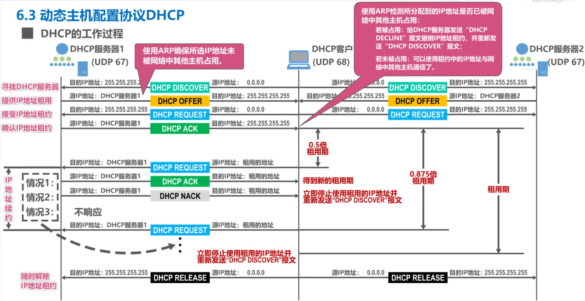
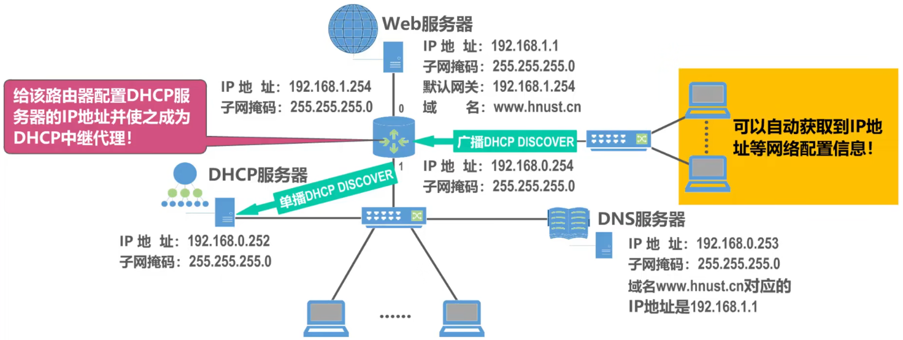

# 概述

- 动态主机配置协议DHCP（Dynamic Host Configuration Protocol）提供了一种机制，称为即插即用连网。这种机制==允许一台计算机加入新网络时可自动获取IP地址等网络配置信息而不用手工参与==
- DHCP主要使用以下报文来实现其功能
  - DHCP DISCOVER：DHCP发现报文
  - DHCP OFFER：DHCP提供报文
  - DHCP REQUEST：DHCP请求报文
  - DHCP ACK：DHCP确认报文
  - DHCP NACK：DHCP否认报文
  - DHCP RELEASE：DHCP释放报文
- DHCP报文==在运输层使用UDP协议封装==
  - DHCP客户使用的UDP端口号为68
  - DHCP服务器使用的UDP端口号为67
- DHCP客户在==未获取到IP地址时使用地址0.0.0.0==
- 在每一个网络上都设置一个DHCP服务器会使DHCP服务器的数量太多。因此现在是使每一个网络至少有一个==DHCP中继代理（通常是一台路由器）==，它配置了DHCP服务器的IP地址信息，作为各网络中计算机与DHCP服务器的桥梁

# 基本工作过程

- 

# DHCP中继代理

- 