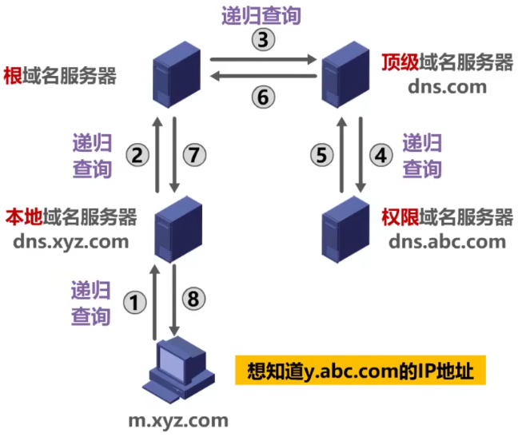
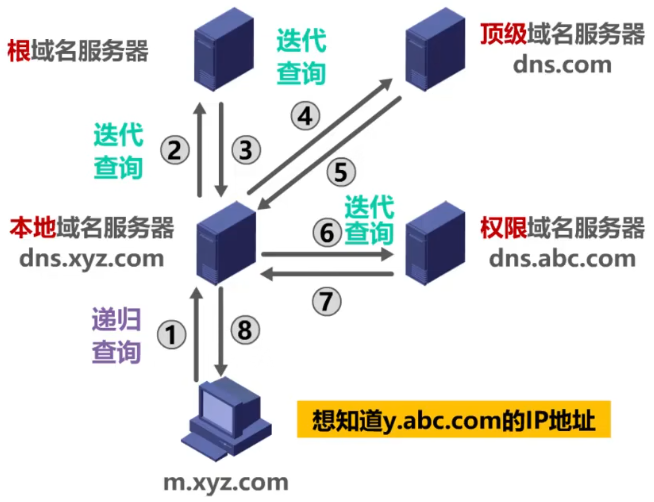

---
域名系统DNS（Domain Name System）
---

# 概述

- 域名系统DNS是因特网使用的命名系统，用来把便于人们记忆的具有特定含义的主机名，转换为便于机器处理的IP地址
- 因特网采用==层次树状结构的域名结构==
- 域名的结构由若干个分量组成，各分量之间用“点”隔开，分别代表不同级别的域名
  - 每一级的域名都由英文字母和数字组成，不超过63个字符，不区分大小写字母
  - 级别最低的域名写在最左边，而级别最高的顶级域名写在最右边
  - 完整的域名不超过255个字符
- 域名系统既不规定一个域名需要包含多少个下级域名，也不规定每一级的域名代表什么意思
- 各级域名由其上一级的域名管理机构管理，而最高的顶级域名则由因特网名称与数字地址分配机构ICANN进行管理

# 域名分级

- 顶级域名TLD（Top Level Domain）
  - 国家顶级域名nTLD：采用ISO 3166的规定。如cn表示中国，us表示美国，uk表示英国、等等
  - 通用顶级域名gTLD：最常见的通用顶级域名有七个，即com（公司企业）、net（网络服务机构）、org（非营利性组织）、int（国际组织）、edu（美国教育机构）、gov（美国政府部门）、mil（美国军事部门）
  - 反向域arpa：用于反向域名解析，即IP地址反向解析为域名
- 在==国家顶级域名下注册的二级域名均由该国家自行确定==
- ==我国==则将==二级域名==划分为以下==两类==
  - 类别域名：共七个，ac（科研机构）、com（工、商、金融等企业）、edu（教育机构）、gov（政府部门）、net（提供网络服务的机构）、mil（军事机构）和org（非营利性组织）
  - 行政区域名：共34个，适用于我国的各省、自治区、直辖市

# 域名服务器

## Remind

- 域名和IP地址的映射关系必须保存在域名服务器中，供所有其他应用查询。DNS使用==分布在各地的域名服务器==来实现域名到IP地址的转换

## 类型

### 根域名服务器

- 根域名服务器是最高层次的域名服务器。每个根域名服务器都知道所有的顶级域名服务器的域名及其IP地址。因特网上共有==13个==不同IP地址的根域名服务器。尽管我们将这13个根域名服务器中的每一个都视为单个的服务器，但“每台服务器”实际上是由许多分布在世界各地的计算机构成的==服务器集群==。当本地域名服务器向根域名服务器发出查询请求时，路由器就把查询请求报文转发到离这个DNS客户最近的一个根域名服务器。这就加快了DNS的查询过程，同时也更合理地利用了因特网的资源。==根域名服务器通常并不直接对域名进行解析，而是返回该域名所属顶级域名的顶级域名服务器的IP地址==

### 顶级域名服务器

- 这些域名服务器负责==管理在该顶级域名服务器注册的所有二级域名==。当收到DNS查询请求时就给出相应的回答（可能是最后的结果，也可能是下一级权限域名服务器的IP地址）

### 权限域名服务器

- 这些域名服务器负责==管理某个区的域名==。每个主机的域名都必须在某个权限域名服务器处注册登记。因此权限域名服务器知道其管辖的域名与IP地址的映射关系。另外，权限域名服务器还知道其下级域名服务器的IP地址

### 本地域名服务器

- 本地域名服务器不属于上述域名服务器的等级结构。当一个主机发出DNS请求报文时，这个报文就首先被送往该主机的本地域名服务器。==本地域名服务器起着代理的作用，会将该报文转发到上述的域名服务器的等级结构中==。每个因特网服务提供者ISP，一个大学，甚至一个大学里的学院，都可以拥有一个本地域名服务器，它有时也称为==默认域名服务器==。本地域名服务器离用户较近，一般不超过几个路由器的距离，也有可能就在同一个局域网中。本地域名服务器的IP地址需要直接配置在需要域名解析的主机中

# 域名解析原理

## Remind

- 为了提高DNS的查询效率，并减轻根域名服务器的负荷和减少因特网上的DNS查询报文数量，在域名服务器中广泛地使用了==高速缓存==。高速缓存用来存放最近查询过的域名以及从何处获得域名映射信息的记录
- 由于域名到IP地址的映射关系并不是永久不变，为保持高速缓存中的内容正确，域名服务器==应为每项内容设置计时器并删除超过合理时间的项==
- 不但在本地域名服务器中需要高速缓存，在用户主机中也很需要。许多用户主机在启动时从本地域名服务器下载域名和IP地址的全部数据库，维护存放自己最近使用的域名的高速缓存，并且只在从缓存中找不到域名时才向域名服务器查询。同理，主机也需要保持高速缓存中内容的正确性

## ==递归查询==

- 

## ==迭代查询==

- 

## Tip

- 由于递归查询对于被查询的域名服务器负担太大，通常采用以下模式：
  ==从请求主机到本地域名服务器的查询是递归查询，而其余查询是迭代查询==

# DNS报文

- 使用运输层的UDP协议进行封装，运输层==端口号为53==
