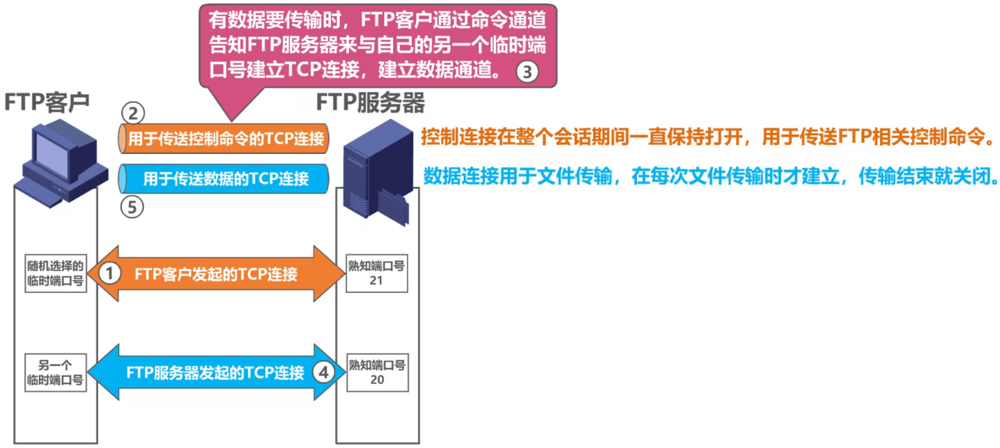
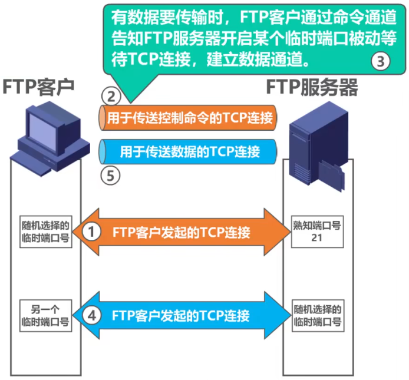

# 概述

- 将某台计算机中的文件通过网络传送到可能相距很远的另一台计算机中，是一项基本的网络应用，即文件传送
- ==文件传送协议FTP==（File Transfer Protocol）是因特网上使用得最广泛的文件传送协议
  - FTP==提供交互式的访问==，允许客户==指明文件的类型与格式==（如指明是否使用ASCII码），并允许==文件具有存取权限==（如访问文件的用户必须经过授权，并输入有效的口令）
  - ==FTP屏蔽了个计算机系统的细节，因而适合于在异构网络中任意计算机之间传送文件==
- 在因特网发展的早期阶段，用FTP传送文件约占整个因特网的通信量的三分之一，而由电子邮件和域名系统所产生的通信量还要小于FTP所产生的通信量。只是到了1995年，万维网WWW的通信量才首次超过了FTP

# 基本工作原理

## 两个TCP连接

### Remind

- FTP客户和服务器之间要==建立两个并行的TCP连接==

### ==控制连接==

- 在整个会话期间一直保持打开，用于传送FTP相关的控制命令

### 数据连接

- 用于文件传输

## 两种传输模式

### Remind

- ==默认情况下，FTP使用TCP 21端口进行控制连接，TCP 20端口进行数据连接==。但是，是否使用TCP 20端口建立数据连接与传输模式有关，==主动方式使用TCP 20端口，被动方式由服务器和客户端自行协商决定==

### 主动模式

- > 建立数据通道时，FTP客户与FTP建立控制数据通道后，FTP服务器主动连接FTP客户

- 

### 被动模式

- > 建立数据通道时，FTP客户与FTP建立控制数据通道后，FTP服务器被动等待FTP客户的连接

- 