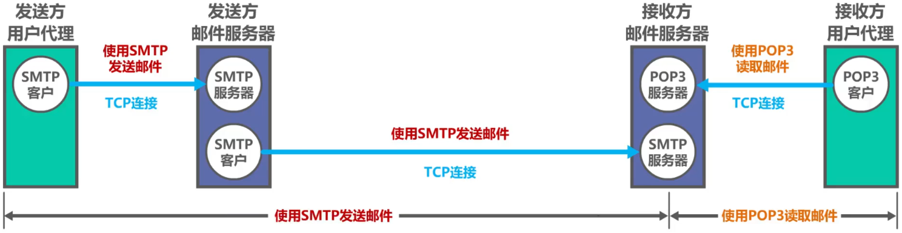
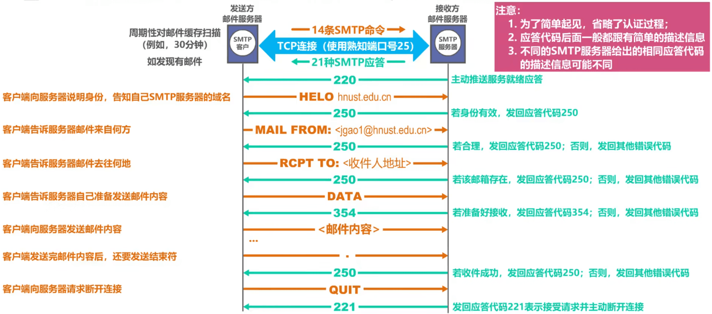
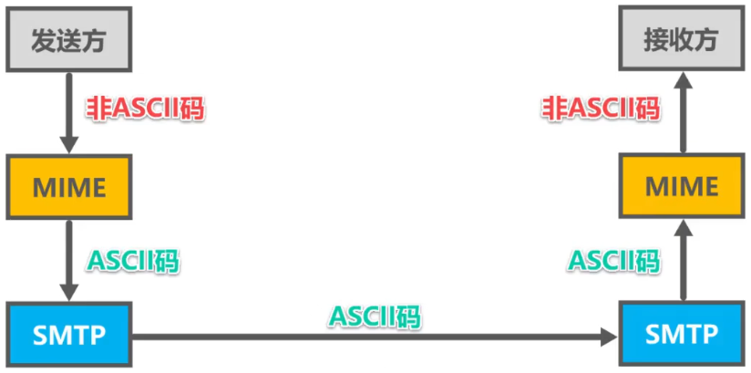
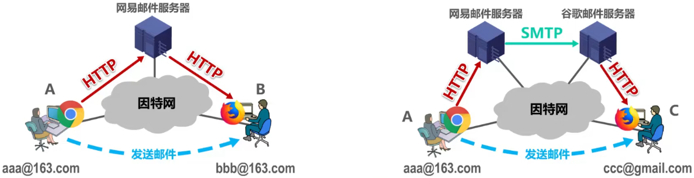

# 概述

- 电子邮件（E-mail）是因特网上==最早流行的一种应用==，并且仍是当今因特网最重要、最实用的应用之一
- 传统的电话通信属于实时通信，存在以下两个缺点
  - 电话通信的主叫和被叫双方必须同时在场
  - 一些不是十分紧迫的电话也尝尝不必要地打断人们的工作或休息
- 而电子邮件与邮政系统的寄信相似
  - 发件人将邮件发送到自己使用的==邮件服务器==
  - 发送人的邮件服务器将收到的邮件按其目的地址转发到收件人邮件服务器中的收件人邮箱
  - 收件人在方便的时候访问收件人邮件服务器中自己的邮箱，获取收到的电子邮件
- 电子邮件使用方便、传递迅速而且费用低廉。它不仅可以传送文字信息，而且还可附上声音和图像
- 由于电子邮件的广泛使用，现在许多国家已经正式取消了电报业务。在我国，==电信局的电报业务也因电子邮件的普及而濒临消失==

# 电子邮件系统

## Remind

- 采用==客户/服务器方式==

## 三个主要组成构件

### ==用户代理==

- 用户与电子邮件系统的接口，又称为==电子邮件客户端软件==

### ==邮件服务器==

- 电子邮件系统的基础设施。因特网上所有的ISP都有邮件服务器，其功能是==发送和接收邮件==，同时还要负责维护用户的邮箱

### ==电子邮件所需的协议==

- ==发送协议==（例如SMTP）
- ==读取协议==（例如POP3，IMAP）

## 发送过程

- 

# 常用邮件协议

## 常用的邮件发送协议

### 简单邮件传送协议SMTP（Simple Mail Transfer Protocol）

#### 基本工作原理

- 

#### Tip

- ==SMTP协议只能传送ASCII码文本数据==，不能传送可执行文件或其他的二进制对象
- SMTP不能满足传送多媒体邮件（例如带有图片、音频或视频数据）的需要。并且许多其他非英语国家的文字也无法用SMTP传送
- 为解决SMTP传送非ASCII码文本的问题，提出了==多用途因特网邮件扩展MIME==（Multipurpose Internet Mail Extensions）
  - 
  - 增加了==5个新的邮件首部字段==，这些字段提供了有关邮件主体的信息
  - 定义了==许多邮件内容的格式==，对多媒体电子邮件的表示方法进行了标准化
  - 定义了==传送编码==，可对任何内容格式进行转换，而不会被邮件系统改变
- 实际上，MIME不仅仅用于SMTP，也用于后来的同样面向ASCII字符的HTTP

## 常用的邮件读取协议

### ==邮局协议POP==（Post Office Protocol）

- POP3是其第三个版本，是因特网正式标准
- 非常简单、功能有限的邮件读取协议。用户只能以==下载并删除方式==或==下载并保留方式==从邮件服务器下载邮件到用户方计算机。==不允许用户在邮件服务器上管理自己的邮件==（例如创建文件夹，对邮件进行分类管理等）

### ==因特网邮件访问协议IMAP==（Internet Message Access Protocol）

- IMAP4是其第四个版本，目前还只是因特网建议标准
- 功能比POP3强大的邮件读取协议。==用户在自己的计算机上就可以操控邮件服务器中的邮箱==，就像在本地操控一样，因此IMAP是一个联机协议

### Tip

- POP3和IMAP4都采用==基于TCP连接的客户/服务器方式==。POP3使用熟知端口110，IMAP4使用熟知端口143

# 基于万维网的电子邮件

- 通过==浏览器==登录（提供用户名和口令）==邮件服务器万维网网站==就可以撰写、收发、阅读和管理电子邮件。这种工作模式与IMAP很类似，不同的是用户计算机无需安装专门的用户代理程序，只需要使用通用的万维网浏览器
- 邮件服务器网站通常都提供非常强大和方便的邮件管理功能，用户可以再邮件服务器网站上管理和处理自己的邮件，而不需要将邮件下载到本地进行管理
- 

# 信息格式

- 电子邮件的信息格式并不是由SMTP定义的，而是在RFC 822中单独定义的。这个RFC文档已在2008年更新为RFC 5322。
- 一个电子邮件的构成
  - ==信封==：==邮件系统将自动提取所需信息并写在信封上==
  - ==内容==
    - ==首部==
      - From：发件人邮件地址
      - ==To==：收件人邮件地址
      - Cc：收件人以外的抄送人邮件地址（抄送人可看可不看邮件，可回可不回邮件）
      - ==Subject==：邮件的主题
    - ==主体==